<p align="center">
  
</p>

# Runa y Piedra (WebGL 2.0 / 60 FPS)

> Mazmorra vóxel cooperativa 3D multijugador en tiempo real para navegadores móviles y de escritorio, optimizada bajo un presupuesto de rendimiento móvil estricto (60 FPS estables) en smartphones estándar globales (3–4 GB RAM, WebGL 2.0).

[](package.json)
[](tests/)
[](https://threejs.org/)
[](https://webrtc.org/)
[](https://vitejs.dev/)
[](LICENSE)

---

## 📸 Vista Previa y Jugabilidad Cooperativa

<p align="center">
  
</p>

*Runa y Piedra* combina estética vóxel *dark fantasy* con mecánicas cooperativas sincronizadas al milisegundo mediante canales duales WebRTC:

* **Puertas Autoritativas de 2×2**: Puertas monumentales de cantería y runas que requieren enfoque o proximidad, consumiendo llaves del inventario de forma sincronizada entre el anfitrión y los invitados.
* **Plataformas de Salto (*Jump Pads*)**: Losas rúnicas talladas en la piedra que impulsan verticalmente a los héroes sobre abismos y fosas letales de lava.
* **Cofres del Tesoro y Botín Dinámico**: Cofres interactivos con animación tridimensional que otorgan llaves de mazmorra, gemas y reliquias míticas compartidas.
* **Fosa de Lava Ardiente y Checkpoints**: Peligros ambientales con penalización de vidas y reaparición inmediata en el punto de control seguro del equipo.
* **Etiquetas 3D Flotantes (*Nametags*)**: Visualización en vivo de la clase, nombre y latencia P2P en tiempo real (< 5 ms en red local) sobre cada aventurero.

---

## 📱 Experiencia Móvil y Controles Adaptativos

<p align="center">
  
</p>

La interfaz móvil está calibrada para pantallas táctiles de 60–120 Hz sin necesidad de instalar apps nativas ni tiendas de aplicaciones:

* **Controles Táctiles Integrados**: Joystick virtual dinámico Nipple.js (mitad izquierda), zona pasiva de rotación *Touch Look* a 120 Hz (mitad derecha) y botones flotantes táctiles de alta visibilidad (`USAR` y `SALTAR`).
* **Panel de Controles Superpuesto y Descartable (UX Guiada)**: 
  * Un panel flotante explica visualmente las acciones esenciales (`WASD`/Joystick para moverse, `Espacio`/`SALTAR` para brincar, `E`/`USAR` para interactuar y `B` para abrir el inventario de botín).
  * **Curva de Aprendizaje Amigable**: Se muestra automáticamente para nuevos jugadores la primera vez.
  * **Ocultable al Instante**: Dispone de un botón de cierre rápido `(×)` que memoriza la preferencia en `localStorage` (`runa_controls_dismissed`).
  * **Siempre Recuperable**: Puede alternarse en cualquier momento pulsando la tecla `H` en el teclado, tocando el botón de ayuda o desde el menú de Ajustes (`⚙️`).
* **HUD Compacto de Explorador**: Corazones vectoriales con contorno estilizado para vidas perdidas, insignia de llaves activas, contador de gemas recolectadas y botón de acceso rápido al inventario de botín (`#hud-inventory`).

---

## 🌟 Características Principales

* **Progresión de Mazmorra por Niveles**: Sistema de niveles modular ([`src/levels/`](file:///data/data/com.termux/files/home/develop/game/src/levels/)) con transiciones fluidas:
  * **Lobby / Tutorial**: Vestíbulo seguro con cofre de prueba, puerta con cerradura y escalinata introductoria.
  * **Calabozo Clásico**: Salas de sillar, fosa de lava ardiente sobre el abismo, plataformas de salto rúnicas y laberinto de puertas.
  * **Trono del Abismo**: Desafío final con altar ancestral y ceremonia de victoria cooperativa.
* **Mecánicas Cooperativas e Interacción**:
  * **Puertas autoritativas de 2×2**: Apertura sincronizada accionable por proximidad o enfoque (con y sin requerimiento de llave).
  * **Consumo de Objetos / Llaves**: Al abrir una puerta sellada, la llave requerida se consume autoritativamente de la entidad `Player` y del inventario en tiempo real.
  * **Cofres del tesoro y Botín**: Cofres interactivos con animación 3D que otorgan llaves de mazmorra, gemas y reliquias míticas.
  * **Plataformas de Salto (*Jump Pads*)**: Losas de cantería oscura con glifo rúnico tallado que impulsan verticalmente al jugador.
  * **Escalinatas de descenso y Pedestales**: Descenso coordinado entre jugadores y ritual de victoria en el altar final.
* **HUD Expandido, Vidas y Botín**:
  * **Vidas con Contorno (*Outline*)**: Corazones llenos en carmesí para vidas activas y contorno estilizado vectorial (`heartOutline`) para vidas perdidas, con animación de sacudida (*shake*).
  * **Insignia de Llaves y Gemas en el HUD**: Insignia dorada de llave activa y contador numérico en vivo de gemas (`.gems-badge`), interactivos al clic/toque.
  * **Botón de Inventario Compacto (`#hud-inventory`)**: Icono botón a la izquierda de las vidas con contador badge dinámico y modal interactivo de botín (atajo tecla `B`).
* **Herramientas de Desarrollo y UX Pulida**:
  * **Panel de Controles Superpuesto**: Guía en pantalla minimizable con botón `(×)`, atajo `H` y persistencia de estado.
  * **Modal Dev (`#modal-dev`)**: Herramientas exclusivas en modo local (`npm run dev`) con reinicio rápido (F5 táctil) y monitor de telemetría WebRTC.
  * **Diálogo Temático de Confirmación**: Sustitución de `confirm()` por modales oscuros con bordes rúnicos y audio procedural para salir al menú.
  * **Orientación Inicial a 180°**: El héroe inicia mirando hacia el pasillo de la mazmorra (`Math.PI`), evitando encarar la pared de spawn.
  * **Scrollbars Dark Fantasy**: Barras de desplazamiento estilizadas en obsidiana y ámbar.
* **Sistema de Peligros y Checkpoints**:
  * 3 vidas por héroe con indicador HUD reactivo.
  * Peligros letales: fosa de lava y caída al vacío con penalización de vida y reaparición en el último checkpoint seguro.
  * Período de invulnerabilidad post-reaparición y Game Over sincronizado.
* **Canales Duales WebRTC de Alto Rendimiento**:
  * **Canal Seguro (`game-safe`, `reliable: true`)**: Transmisión garantizada de eventos críticos (`INIT`, `DOOR`, `CHEST`, `KEY`, `LEVEL_CHANGE`, `PLAYER_META`, `HOST_CLOSING`).
  * **Canal Caliente (`game-hot`, `reliable: false`)**: Tráfico de alta frecuencia tolerante a pérdida (`INPUT` a 30 Hz, `SNAPSHOT` a 20 Hz, `PING`/`PONG` a 1 Hz) para eliminar el *head-of-line blocking*.
  * Reintentos automáticos, timeouts robustos y fallback transparente a canal seguro.
* **Predicción y Reconciliación del Cliente**: Movimiento local con cero latencia percibida, búfer circular de inputs no confirmados y reconciliación autoritativa en [`ClientReconciler`](file:///data/data/com.termux/files/home/develop/game/src/network/ClientReconciler.js).
* **Audio Procedural Sintetizado**: Motor de sonido basado en Web Audio API ([`SoundManager`](file:///data/data/com.termux/files/home/develop/game/src/audio/SoundManager.js)) que genera efectos de salto, apertura de puertas, llaves, daño y victoria sin descargar activos pesados.
* **Lobby de Configuración de Aventurero**: Personalización de nombre o apodo, selección de clase y color de héroe con persistencia en `localStorage`.
* **Compartir Enlace por Mensajería (WhatsApp / Telegram)**: Botón integrado con Web Share API (`navigator.share`) para enviar enlaces de invitación directa (`?join=XXXX`) con un solo toque, además de botón de copiado al portapapeles.
* **Conexión Instantánea por Código QR o PIN**: El Host genera una sala con PIN de 4 dígitos y un código QR dinámico que el invitado puede escanear con la cámara de su celular para unirse automáticamente sin escribir nada.
* **Presupuesto de Rendimiento Móvil Estricto**:
  * **Draw Calls**: Menos de 25 por cuadro (toda la mazmorra se dibuja en **1 solo `THREE.InstancedMesh`**).
  * **Límite DPR ($\le 1.5$)**: `renderer.setPixelRatio(Math.min(window.devicePixelRatio, 1.5))` para evitar estrangulamiento térmico de GPUs móviles (Mali-G52 / Adreno 610).
  * **Sin Garbage Collection (Zero-GC)**: Paquetes binarios fijos con `DataView` y `ArrayBuffer` reutilizados en el bucle principal.
  * **Físicas Desacopladas a 30 Hz**: Motor de colisiones AABB propio sin sobrecarga en la CPU del teléfono.
* **Suite de Pruebas Unitarias Integrada**: 107 pruebas automatizadas con el ejecutor nativo `node:test` cubriendo protocolo binario, colisiones, reconciliación, vidas, inventario, niveles y contratos de UI.

---

## 🏗️ Arquitectura del Proyecto

El código está estructurado bajo **Clean Architecture** y principios de **Responsabilidad Única (SRP)**:

```
runa-y-piedra/
├── docs/                     # Documentación técnica completa y guías de arquitectura
│   └── assets/               # Diagramas vectoriales SVG de jugabilidad y HUD móvil
├── tests/                    # Suite de 107 pruebas automatizadas (node:test)
├── src/
│   ├── audio/
│   │   └── SoundManager.js   # Efectos de sonido procedurales con Web Audio API
│   ├── camera/
│   │   └── CameraController.js # Vista en primera persona y rotación suave
│   ├── config/
│   │   └── constants.js      # Constantes de mundo, físicas, red y colores
│   ├── controllers/
│   │   ├── DescentManager.js # Gestión de escalinatas y transición de niveles
│   │   └── InteractionController.js # Detección de proximidad e interacciones HUD
│   ├── core/
│   │   ├── GameLoop.js       # Acumulador desacoplado a 30 Hz y render a rAF
│   │   ├── PhysicsAABB.js    # Resolución de colisiones por ejes
│   │   └── World.js          # Voxel Grid optimizado
│   ├── entities/
│   │   ├── Player.js         # Entidad jugador (físicas, vidas, llaves)
│   │   └── PlayerManager.js  # Gestión de jugadores locales y remotos
│   ├── heroes/
│   │   ├── data/             # Definiciones de clases de héroes
│   │   └── HeroRegistry.js   # Registro y persistencia de perfiles
│   ├── input/
│   │   └── InputManager.js   # Joystick táctil, Touch Look, Teclado y Ratón
│   ├── interaction/
│   │   └── BlockRaycaster.js # Raycast central y selección de objetivos
│   ├── levels/
│   │   ├── data/             # Niveles (lobby, dungeon_classic, abyss_throne)
│   │   ├── LevelLoader.js    # Carga y ensamblado de vóxeles y sensores
│   │   └── LevelRegistry.js  # Registro de mazmorras y progresión
│   ├── network/
│   │   ├── ClientReconciler.js # Predicción y reconciliación de movimiento
│   │   ├── InputQueue.js     # Cola autoritativa de inputs en el Host
│   │   ├── NetworkManager.js # Canales duales WebRTC (game-safe / game-hot)
│   │   ├── NetworkStats.js   # Monitor de latencia RTT, ancho de banda y paquetes
│   │   └── Protocol.js       # Protocolo binario de cero asignación (Zero-GC)
│   ├── render/
│   │   ├── AvatarRenderer.js # Avatares 3D con interpolación Lerp y nametags
│   │   ├── ChestRenderer.js  # Mallas de cofres y estados de apertura
│   │   ├── DoorRenderer.js   # Mallas de puertas correderas 2x2
│   │   ├── PedestalRenderer.js # Altar y orbe ancestral de victoria
│   │   ├── SceneManager.js   # Three.js WebGL 2.0, niebla y luces fijas
│   │   ├── StairsRenderer.js # Losa y escalinata de descenso
│   │   ├── TextureGenerator.js # Atlas de texturas SVG procedurales
│   │   └── VoxelMap.js       # Terreno InstancedMesh único
│   ├── simulation/
│   │   └── SimulationEngine.js # Físicas del Host y predicción del Cliente
│   ├── ui/
│   │   ├── Icons.js          # Iconografía SVG para botones y HUD
│   │   ├── InputMode.js      # Detección inteligente táctil vs PC
│   │   ├── Spring.js         # Física de resortes para animaciones UI
│   │   └── UIManager.js      # Menú, QR, selección de héroe, HUD y modales
│   └── main.js               # Orquestador del juego
├── index.html                # Canvas a pantalla completa, UI, HUD y controles
├── package.json              # Dependencias y scripts
└── vite.config.js            # Configuración de Vite con host expuesto
```

---

## 🚀 Inicio Rápido

### Prerrequisitos
* Node.js v18+ y npm instalados.

### Instalación y Ejecución

```bash
# 1. Instalar dependencias
npm install

# 2. Ejecutar suite de pruebas unitarias (107 tests)
npm test

# 3. Iniciar servidor de desarrollo en red local
npm run dev

# 4. Compilar para producción
npm run build
```

---

## 🎮 Cómo Jugar (Flujo de Conexión & Onboarding)

El juego utiliza una arquitectura de conexión P2P sin registros ni descargas:

```
┌─────────────────────────────────┐                 ┌─────────────────────────────────┐
│       DISPOSITIVO 1 (HOST)      │                 │     DISPOSITIVO 2 (INVITADO)    │
├─────────────────────────────────┤                 ├─────────────────────────────────┤
│ 1. Pulsa "Crear Sala".          │                 │ 1. Abre la cámara del celular.  │
│ 2. El sistema reserva el PIN    │  ESCANEADO QR   │ 2. Apunta al código QR en       │
│    (ej. 4821) en PeerJS.        │ ──────────────> │    la pantalla del Host.        │
│ 3. Muestra en pantalla el QR    │   (1 Segundo)   │ 3. Abre el enlace (?join=4821). │
│    y el enlace de invitación.   │                 │ 4. ¡Conexión WebRTC directa!    │
└─────────────────────────────────┘                 └─────────────────────────────────┘
```

### 1. Dispositivo 1 (Host / Servidor Autoritativo):
* Abre la URL del juego (`https://...` o `http://localhost:5173`).
* Personaliza tu nombre y clase de aventurero.
* Pulsa en **"Crear Sala"**.
* El juego genera automáticamente:
  * Un **PIN de 4 dígitos** exclusivo (ej. `4821`).
  * Un **Código QR dinámico** generado en tiempo real con la biblioteca `qrcode`.
  * Botones para **"Copiar Enlace"** y **"Compartir en Mensajería"** (vía WhatsApp / Telegram con Web Share API).

### 2. Dispositivo 2 (Cliente / Invitado):
* **Opción A: Escaneo de Código QR (*Recomendada en móvil*)**:
  * Abre la aplicación de cámara de tu teléfono móvil.
  * Apunta al código QR desplegado en la pantalla del Host.
  * Toca la notificación que aparece: el enlace contiene el parámetro `?join=4821`.
  * ¡El cliente se conecta de inmediato por WebRTC a la mazmorra sin escribir una sola letra!
* **Opción B: Enlace Compartido**:
  * Toca el enlace de invitación recibido por WhatsApp, Telegram o Discord.
* **Opción C: PIN Manual**:
  * Abre la web del juego, escribe el PIN de 4 dígitos en el campo "Código de Sala" y pulsa **"Unirse"**.

---

## 🌐 Arquitectura Listen-Server y Gestión de Desconexión

Al ejecutarse 100% en el navegador mediante canales de datos WebRTC (`RTCDataChannel`), el juego no requiere servidores dedicados en la nube:

### ¿Qué ocurre si el Host se desconecta?
1. **Salida Limpia (Graceful Teardown)**: Si el jugador anfitrión cierra la pestaña o navega a otra web, los eventos `beforeunload` y `pagehide` envían un paquete binario garantizado `HOST_CLOSING` (`0x07`) a través del canal seguro `game-safe`.
2. **Desconexión Abrupta (Crash, Batería o Corte Wi-Fi)**: Si el dispositivo del Host se apaga o pierde cobertura súbitamente, el cliente detecta el cierre inmediato en el evento `safe.on('close')` y por caída de acuses de recibo en el monitor de telemetría RTT/Heartbeat a 1 Hz.
3. **Respuesta en la Interfaz (UX)**: El cliente no se queda congelado; recibe una notificación narrativa flotante (*"🏰 El anfitrión ha abandonado o cerrado la partida"*), reproduce un sonido de alerta y es redirigido suavemente al vestíbulo principal.

### Hoja de Ruta: Migración Automática de Host (*Host Migration*)
La arquitectura técnica ([`docs/06-arquitectura-listen-server-hosting.md`](docs/06-arquitectura-listen-server-hosting.md)) documenta el diseño para la próxima fase:
* **Elección de Líder Distribuida**: Algoritmo determinista donde el peer con menor RTT y mayor permanencia asume el rol de Host.
* **Snapshot de Mazmorra Compartido**: Difusión periódica del estado del mundo (bloques rotos, puertas abiertas, cofres saqueados, llaves y checkpoints) para que el nuevo Host retome la simulación en menos de 2 segundos.
* **Respaldo Local (`sessionStorage`)**: Salvaguarda del progreso del capítulo en el navegador para permitir reanudar la expedición en caso de caída total de la sala.

---

## 🕹️ Tabla de Controles

| Acción | Móvil / Pantalla Táctil | Escritorio (PC) |
|---|---|---|
| **Moverse** | Joystick virtual dinámico (mitad izquierda) | Teclas `W`, `A`, `S`, `D` |
| **Mirar / Girar Cámara** | Arrastrar dedo en la mitad derecha (*Touch Look* a 120 Hz) | Mover el ratón (clic para fijar Pointer Lock) |
| **Saltar / Brincar** | Botón flotante `SALTAR` | Barra `Espaciadora` |
| **Interactuar / Usar** | Botón flotante `USAR` (ámbar) | Teclas `E`, `F` o Clic izquierdo |
| **Inventario de Botín** | Botón cofre en el HUD (`#hud-inventory`) | Tecla `B` o Clic en cofre/gemas |
| **Poción de Vida** | Botón "Beber" dentro del modal de botín | Tecla `P` |
| **Guía de Controles (HUD)** | Tocar botón `(×)` en el panel de controles | Tecla `H` (alternar) o Menú de Ajustes (`⚙️`) |
| **Menú y Ajustes** | Botón engranaje `⚙️` en la esquina superior derecha | Tecla `Escape` |

---

## 📚 Documentación Técnica Detallada

La carpeta [`docs/`](docs/) contiene el desglose técnico, análisis de hardware y decisiones de diseño:

* [**00. Especificación Maestra de Requerimientos**](docs/00-especificacion-maestra.md)
* [**01. Requerimientos de Hardware y Presupuesto de Rendimiento**](docs/01-hardware-y-presupuesto-rendimiento.md)
* [**02. Stack Tecnológico de 6 Capas**](docs/02-stack-tecnico-6-capas.md)
* [**03. Protocolo de Red Binario y Señalización WebRTC**](docs/03-protocolo-red-binario-webrtc.md)
* [**04. Motor de Físicas y Estructura de Vóxeles**](docs/04-motor-fisica-voxeles.md)
* [**05. Controles Táctiles y Experiencia Móvil (UX)**](docs/05-controles-moviles-ux.md)
* [**06. Arquitectura Listen-Server, Desconexión, Migración y Onboarding**](docs/06-arquitectura-listen-server-hosting.md)
* [**07. Arquitectura Atómica y Modular del Código**](docs/07-arquitectura-atomica-modular.md)
* [**08. Sistema de Mazmorras, Niveles y Progresión Cooperativa**](docs/08-sistema-mazmorras-niveles-y-progresion.md)
* [**09. Biblioteca de Héroes, Clases Únicas y Modificadores Físicos**](docs/09-biblioteca-heroes-clases-y-fisica.md)
* [**10. Sistema de Iconografía SVG Vectorial y Experiencia de Usuario (UI/UX)**](docs/10-sistema-iconografia-svg-y-ui-ux.md)
* [**11. Protocolo Híbrido v2, Telemetría de Red y Resiliencia WebRTC**](docs/11-protocolo-hibrido-v2-telemetria-y-resiliencia.md)
* [**12. Reconciliación Cliente-Servidor Real e Interpolación Temporal**](docs/12-reconciliacion-cliente-servidor-e-interpolacion.md)
* [**13. Canales Duales WebRTC y Endurecimiento de Conexión P0**](docs/13-canales-duales-webrtc-endurecimiento-p0.md)
* [**14. Subsistemas de Audio Procedural, Vidas, Resortes y Suite de Tests**](docs/14-subsistemas-audio-procedural-vidas-y-resortes.md)
* [**15. Flujo de Trabajo Git y Creación de Nuevos Niveles de Mazmorra**](docs/15-flujo-de-trabajo-git-y-creacion-de-niveles.md)
* [**17. Arquitectura de Capítulos y Escalado de Mazmorras (10 Capítulos × 3 Niveles)**](docs/17-arquitectura-de-capitulos-y-escalado-de-mazmorras.md)
* [**18. Sistema de Inventario, HUD Expandido y Herramientas de Desarrollo**](docs/18-inventario-hud-y-herramientas-desarrollo.md)
* [**19. Límite de Jugadores y Unicidad de Clases**](docs/19-limite-jugadores-y-clases-unicas.md)
* [**20. Bloques de Respawn y Aparición Rúnica**](docs/20-bloques-respawn-y-aparicion-runica.md)
* [**21. Sprite de Lava y Renderizado Ígneo**](docs/21-sprite-lava-y-renderizado-igneo.md)

---

## 📄 Licencia

Este proyecto está bajo la Licencia MIT.
