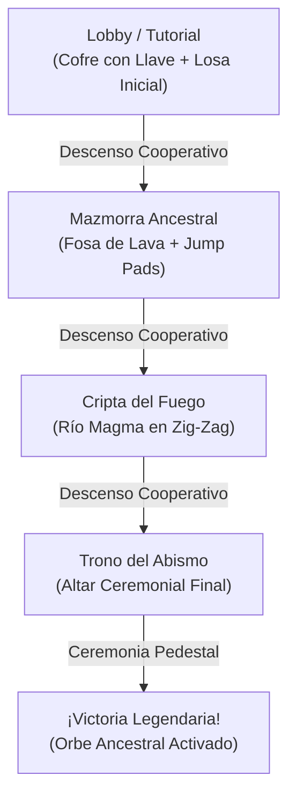

# 08. Sistema de Mazmorras, Niveles y Progresión Cooperativa

Este documento describe la arquitectura declarativa de escenarios, la progresión secuencial por salas, las mecánicas de parkour y salto obligatorio, el sistema de checkpoints dinámicos, los cofres de botín interactivos y la ambientación visual subterránea.

---

## 1. Arquitectura de Niveles Desacoplada (Data-Driven)

En lugar de construir la mazmorra de forma procedimental o rígida en código fuente, los escenarios se definen en archivos JSON desacoplados dentro de [`src/levels/data/`](file:///data/data/com.termux/files/home/develop/game/src/levels/data/).

### Catálogo de Niveles Registrados

1. **[`lobby_tutorial.json`](file:///data/data/com.termux/files/home/develop/game/src/levels/data/lobby_tutorial.json)** — *Vestíbulo de Entrenamiento*:
   - **Dimensiones**: $24 \times 16 \times 24$ bloques vóxel.
   - **Propósito**: Sala introductoria segura, hub de conexión y punto de reaparición tras Game Over.
   - **Elementos**: Cofre de entrenamiento con Llave Ancestral, portón blindado con cerradura y losa rúnica de descenso hacia el calabozo principal.
2. **[`dungeon_classic.json`](file:///data/data/com.termux/files/home/develop/game/src/levels/data/dungeon_classic.json)** — *Mazmorra Ancestral: Las Tres Cámaras*:
   - **Dimensiones**: $24 \times 16 \times 36$ bloques vóxel.
   - **Sala 1 (Vestíbulo)**: Columnas monolíticas de sillar oscuro y *Cofre Antiguo* con Llave de Bronce.
   - **Sala 2 (El Abismo y Fosa de Lava)**: Foso letal con río de lava ardiente en el fondo, plataformas suspendidas y plataformas de salto rúnico (*Jump Pads*).
   - **Sala 3 (Santuario Ancestral)**: Cámara final con losa de descenso oculta hacia la cripta infernal.
3. **[`crypt_inferno.json`](file:///data/data/com.termux/files/home/develop/game/src/levels/data/crypt_inferno.json)** — *Cripta del Fuego: Rocas Volcánicas*:
   - **Dimensiones**: $24 \times 16 \times 36$ bloques vóxel.
   - **Sala 1 (Vestíbulo de Cenizas)**: Pilares de basalto y *Cofre de Brasas*.
   - **Sala 2 (Río de Lava Extendido)**: Plataformas en zig-zag sobre magma activo.
   - **Sala 3 (Altar Ígneo)**: Losa rúnica de descenso hacia el nivel final.
4. **[`abyss_throne.json`](file:///data/data/com.termux/files/home/develop/game/src/levels/data/abyss_throne.json)** — *Trono del Abismo (Nivel Cumbre)*:
   - **Dimensiones**: $24 \times 16 \times 36$ bloques vóxel.
   - **Cámara Soberana**: Plataforma central suspendida sobre la nada infinita, custodiada por columnas colosales.
   - **Sin Escalinata de Descenso**: Aloja el *Pedestal Ancestral* definitivo con el orbe de victoria y ceremonia final cooperativa.

### Componentes del Subsistema

- **[`LevelLoader.js`](file:///data/data/com.termux/files/home/develop/game/src/levels/LevelLoader.js)**: Intérprete que traduce directivas JSON (`perimeter`, `fill`, `divider`, `pillar`, `ceiling`, `chests`, `checkpoints`, `doors`, `stairs`, `lava`) a la matriz 3D en [`World.js`](file:///data/data/com.termux/files/home/develop/game/src/core/World.js).
- **[`LevelRegistry.js`](file:///data/data/com.termux/files/home/develop/game/src/levels/LevelRegistry.js)**: Catálogo en memoria que administra los 4 niveles y coordina la progresión ordenada o conmutación en caliente sin interrumpir la sesión WebRTC.
- **[`DescentManager.js`](file:///data/data/com.termux/files/home/develop/game/src/controllers/DescentManager.js)**: Orquestador del flujo de descenso cooperativo mediante máquina de estados (`START` $\rightarrow$ `GO` $\rightarrow$ `NOW`).

---

## 2. Progresión por Estancias y Objetivos Cooperativos

### Mecánicas de Desbloqueo y Avance

1. **Llaves y Puertas con Cerradura**:
   - Determinadas puertas tienen `requiresKey: true`. El botón de acción contextual solo permite abrirlas si el jugador ha recogido previamente la llave de la sala desde un cofre.
   - El Host valida la posesión de la llave en [`Player.js`](file:///data/data/com.termux/files/home/develop/game/src/entities/Player.js) y transmite el mensaje `KEY` (`0x0C`) a los clientes para sincronizar el estado visual en el HUD.
2. **Escalinata de Descenso y Losa Rúnica ([`StairsRenderer.js`](file:///data/data/com.termux/files/home/develop/game/src/render/StairsRenderer.js))**:
   - En lugar de cambios de nivel instantáneos, los jugadores descubren una losa rúnica sellada en el suelo.
   - Un aventurero acciona la losa (`STAIRS_REQ`), el Host valida y emite `STAIRS_OPEN`. La losa se repliega suavemente revelando una escalinata descendente.
   - Al pisar el sensor de descenso, [`DescentManager.js`](file:///data/data/com.termux/files/home/develop/game/src/controllers/DescentManager.js) inicia una cuenta atrás de 3 segundos con mensajes narrativos sincronizados y teletransporta a todos los miembros de la expedición al spawn del siguiente nivel.
3. **Plataformas de Salto Rúnico (*Jump Pads*)**:
   - Bloques especiales (`BLOCK_TYPES.JUMP_PAD`, casilla 14 del atlas de texturas) construidos con base de sillar oscuro, cantoneras de hierro con 12 remaches dorados y un glifo ámbar en relieve.
   - En [`PhysicsAABB.js`](file:///data/data/com.termux/files/home/develop/game/src/core/PhysicsAABB.js), al detectar contacto con la cara superior de un *Jump Pad*, se inyecta instantáneamente un impulso vertical de $v_y = 12.0\text{ m/s}$, permitiendo sortear fosos de lava insalvables con salto convencional.
4. **Pedestal Ancestral de Victoria ([`PedestalRenderer.js`](file:///data/data/com.termux/files/home/develop/game/src/render/PedestalRenderer.js))**:
   - Ubicado en el corazón del Trono del Abismo.
   - Al interactuar ambos jugadores o el líder de expedición, se dispara la ceremonia: orbe brillante en rotación, haz de luz ascendente y fanfarria triunfal sintetizada por [`SoundManager.js`](file:///data/data/com.termux/files/home/develop/game/src/audio/SoundManager.js).

---

## 3. Dinámica de Peligros, Sistema de 3 Vidas y Checkpoints

### Peligros Ambientales Letales
- **Fosa de Lava (`BLOCK_TYPES.LAVA`)**:
  - Presente en el fondo de las simas de *dungeon_classic* y *crypt_inferno*.
  - El motor de físicas AABB comprueba intersección con bloques de tipo lava; al rozarla, el jugador pierde 1 vida inmediatamente y reproduce el efecto sonoro de quemadura.
- **Caída al Vacío**:
  - Si el jugador cae por debajo de `VOID_RESCUE_Y = -4.5`, sufre daño letal por caída al vacío, perdiendo 1 vida.

### Ciclo de Vidas y Reaparición
- Cada jugador cuenta con **3 vidas**.
- **Persistencia de Vidas en Todo el Capítulo**: Las vidas perdidas se conservan entre las diferentes mazmorras de la expedición. Al descender o avanzar a una nueva mazmorra mediante la escalinata ritual, el jugador mantiene exactamente sus vidas restantes (no se rellenan automáticamente al superar una estancia).
- **Restauración Exclusiva por Muerte / Game Over**: Las vidas se rellenan al máximo ($3$) únicamente si la party o el aventurero sufre un **Game Over** (alcanzar $0$ vidas) y se reinicia el nivel / expedición regresando al *Lobby / Tutorial*.
- **Invulnerabilidad Post-Respawn**: Tras reaparecer en la losa rúnica del spawn, el jugador recibe **2 segundos de invulnerabilidad** (`invulnTicks = 60`), indicada mediante el filtro y brillo del HUD y el parpadeo del avatar, evitando muertes consecutivas inmediatas.
- **Game Over Cooperativo**: Al agotarse las 3 vidas, se muestra la pantalla de Game Over y se regresa al *Lobby / Tutorial* con vidas restauradas para reiniciar la expedición.

### Registro Dinámico de Puntos de Control (Checkpoints)
En [`SimulationEngine.js`](file:///data/data/com.termux/files/home/develop/game/src/simulation/SimulationEngine.js), cuando el jugador pisa suelo firme ($p.pos.y \ge 0.95$ y $p.onGround$), se registra automáticamente el punto de control correspondiente al tramo $z$:

| Estancia | Rango Z | Coordenadas de Reaparición | Mensaje de HUD |
| :--- | :---: | :---: | :--- |
| **Sala 1 (Vestíbulo)** | $0.0 \le z < 11.0$ | $(12.0, 1.2, 4.5)$ | *Reapareciendo en Sala 1 (Vestíbulo)...* |
| **Sala 2 (El Abismo / Lava)** | $11.0 \le z < 24.0$ | $(11.5, 1.2, 12.0)$ | *Reapareciendo en Sala 2 (El Abismo)...* |
| **Sala 3 (Santuario Ancestral)** | $24.0 \le z \le 36.0$ | $(11.5, 1.2, 25.0)$ | *Reapareciendo en Sala 3 (Santuario)...* |

---

## 4. Cofres del Tesoro Interactivos ([`ChestRenderer.js`](file:///data/data/com.termux/files/home/develop/game/src/render/ChestRenderer.js))

### Modelo 3D y Cinemática
- **Estructura Vóxel**: Base de madera de roble (`0x78350f`), cantoneras y bisagras doradas (`0xfbbf24`), cerradura de hierro forjado (`0x475569`) y botín interior con gemas y lingotes brillantes.
- **Animación en Tiempo Real**: Al accionar el botón **ACTION** cerca del cofre, la tapa rota suavemente sobre su eje de bisagra trasera hasta un ángulo de apertura de $77^\circ$ ($\approx 1.35\text{ rad}$).

### Sincronización de Red P2P
1. El cliente detecta la colisión visual del raycast hacia el cofre.
2. Emite el mensaje binario `CHEST_OPEN` (`0x07`) a través de [`Protocol.js`](file:///data/data/com.termux/files/home/develop/game/src/network/Protocol.js).
3. El Host valida la apertura, bloquea reaperturas y difunde el estado a todos los compañeros conectados.
4. Si el cofre contiene una llave de mazmorra, el Host emite además el evento `KEY` (`0x0C`), añadiéndola al inventario del equipo.
5. Todos los clientes ven abrirse la tapa al unísono y reciben el mensaje narrativo del botín en el HUD.

---

## 5. Iluminación y Visibilidad

- **Iluminación Ambiental Clara**: Luz ambiental blanca pura (`AmbientLight` a `0.95`) complementada por luz direccional cenital (`DirectionalLight` a `0.70`). Esto elimina sombras opacas impenetrables y asegura visibilidad total en dispositivos móviles.
- **Niebla Cripta Suave**: Fondo slate-800 (`0x1e293b`) con niebla a distancia extendida ($35\text{ m}$ a $80\text{ m}$), otorgando atmósfera subterránea limpia sin restar nitidez al recorrido.
