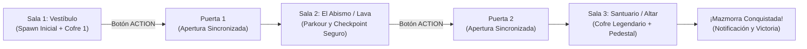

# 08. Sistema de Mazmorras, Niveles y Progresión Cooperativa

Este documento describe la arquitectura declarativa de escenarios, la progresión secuencial por salas, las mecánicas de parkour y salto obligatorio, el sistema de checkpoints dinámicos, los cofres de botín interactivos y la ambientación visual subterránea.

---

## 1. Arquitectura de Niveles Desacoplada (Data-Driven)

En lugar de construir la mazmorra de forma procedimental o rígida en código fuente, los escenarios se definen en archivos JSON desacoplados dentro de [`src/levels/data/`](file:///data/data/com.termux/files/home/develop/game/src/levels/data/).

### Catálogo de Niveles Registrados

1. **[`dungeon_classic.json`](file:///data/data/com.termux/files/home/develop/game/src/levels/data/dungeon_classic.json)** — *Mazmorra Ancestral: Las Tres Cámaras*:
   - **Dimensiones**: $24 \times 16 \times 36$ bloques vóxel.
   - **Sala 1 (Vestíbulo)**: Recepción con columnas de piedra labrada y *Cofre Antiguo* (Llave Antigua + 100 Gemas).
   - **Sala 2 (El Abismo)**: Foso sin fondo con plataformas de salto rúnico sobre el vacío.
   - **Sala 3 (Santuario Ancestral)**: Cámara final con *Cofre Secreto* (Cáliz Sagrado + 250 Gemas) y el *Pedestal Ancestral* de victoria.
2. **[`crypt_inferno.json`](file:///data/data/com.termux/files/home/develop/game/src/levels/data/crypt_inferno.json)** — *Cripta del Fuego: Rocas Volcánicas*:
   - **Dimensiones**: $24 \times 16 \times 36$ bloques vóxel.
   - **Sala 1 (Vestíbulo de Cenizas)**: Pilares de basalto y *Cofre de Brasas* (Esquirla de Magma + 120 Gemas Volcánicas).
   - **Sala 2 (Río de Lava)**: Lago de magma ardiente con plataformas en zig-zag.
   - **Sala 3 (Altar Ígneo)**: *Cofre Volcánico* (Corazón del Volcán + 300 Gemas) y Altar de Fuego.

### Componentes del Subsistema

- **[`LevelLoader.js`](file:///data/data/com.termux/files/home/develop/game/src/levels/LevelLoader.js)**: Intérprete que traduce directivas JSON (`perimeter`, `fill`, `divider`, `pillar`, `ceiling`, `chests`, `checkpoints`, `doors`) a la matriz 3D en [`World.js`](file:///data/data/com.termux/files/home/develop/game/src/core/World.js).
- **[`LevelRegistry.js`](file:///data/data/com.termux/files/home/develop/game/src/levels/LevelRegistry.js)**: Catálogo en memoria que permite al anfitrión (Host) cambiar de nivel en caliente desde la configuración sin reiniciar la conexión WebRTC.

---

## 2. Progresión por Estancias y Objetivos Cooperativos

### Directivas de Construcción Arquitectónica

- **Techos Abovedados (`ceiling`)**:
  - Toda la mazmorra está techada a altura $y = 6$ ($5.0\text{ m}$ libres de altura interior).
  - Permite saltos máximos sobre plataformas elevadas con más de $1\text{ m}$ de holgura.
  - La física de colisiones en [`SimulationEngine.js`](file:///data/data/com.termux/files/home/develop/game/src/simulation/SimulationEngine.js) detecta impacto superior (`r.hitY && p.vel.y > 0`) y anula la velocidad vertical hacia arriba para una caída natural.
- **Suelo Continuo bajo Puertas**:
  - El umbral de las puertas situadas en $z = 11$ y $z = 24$ garantiza losas de piedra sólidas (`STONE_FLOOR`, $y = 0$). Al abrir el portón, el suelo permanece $100\%$ transitable y plano sin huecos vacíos.

---

## 3. Dinámica de Caída Libre y Checkpoints por Sala

### Sensación de Vértigo en el Abismo
- **Umbral de Rescate del Vacío**: Configurado en [`constants.js`](file:///data/data/com.termux/files/home/develop/game/src/config/constants.js) como `VOID_RESCUE_Y = -4.5`.
- **Distancia Vertical**: Desde el plano transitable ($y = 1.0$), el aventurero experimenta $5.5\text{ metros}$ de caída libre acelerada ($g = -20\text{ m/s}^2$).
- **Tiempo y Velocidad**: $\approx 0.74\text{ s}$ de vuelo descendente, alcanzando velocidades cercanas a $-15\text{ m/s}$, transmitiendo un auténtico vértigo al errar un salto.

### Registro Dinámico de Puntos de Control (Checkpoints)
En [`SimulationEngine.js`](file:///data/data/com.termux/files/home/develop/game/src/simulation/SimulationEngine.js), cuando el jugador pisa suelo firme ($p.pos.y \ge 0.95$ y $p.onGround$), se registra automáticamente el punto de control correspondiente al tramo $z$:

| Estancia | Rango Z | Coordenadas de Reaparición | Mensaje de HUD |
| :--- | :---: | :---: | :--- |
| **Sala 1 (Vestíbulo)** | $0.0 \le z < 11.0$ | $(12.0, 1.2, 4.5)$ | *Reapareciendo en Sala 1 (Vestíbulo)...* |
| **Sala 2 (El Abismo / Lava)** | $11.0 \le z < 24.0$ | $(11.5, 1.2, 12.0)$ | *Reapareciendo en Sala 2 (El Abismo)...* |
| **Sala 3 (Santuario Ancestral)** | $24.0 \le z \le 36.0$ | $(11.5, 1.2, 25.0)$ | *Reapareciendo en Sala 3 (Santuario)...* |

- **Prevención de Elevación a Bardas**: Se eliminó cualquier bucle de corrección vertical indiscriminada. Si un jugador cae rozando un muro lateral, sufre caída limpia al abismo sin ser teletransportado a la cornisa.

---

## 4. Cofres del Tesoro Interactivos ([`ChestRenderer.js`](file:///data/data/com.termux/files/home/develop/game/src/render/ChestRenderer.js))

### Modelo 3D y Cinemática
- **Estructura Vóxel**: Base de madera de roble (`0x78350f`), cantoneras y bisagras doradas (`0xfbbf24`), cerradura de hierro forjado (`0x475569`) y botín interior con gemas y lingotes brillantes.
- **Animación en Tiempo Real**: Al accionar el botón **ACTION** cerca del cofre, la tapa rota suavemente sobre su eje de bisagra trasera hasta un ángulo de apertura de $77^\circ$ ($\approx 1.35\text{ rad}$).

### Sincronización de Red P2P
1. El cliente detecta la colisión visual del raycast hacia el cofre.
2. Emite el mensaje binario `CHEST_OPEN` a través de [`Protocol.js`](file:///data/data/com.termux/files/home/develop/game/src/network/Protocol.js).
3. El Host valida la apertura, bloquea re-aperturas y difunde el estado a todos los compañeros conectados.
4. Todos los clientes ven abrirse la tapa al unísono y reciben el mensaje narrativo del botín en el HUD.

---

## 5. Iluminación y Visibilidad

- **Iluminación Ambiental Clara**: Luz ambiental blanca pura (`AmbientLight` a `0.95`) complementada por luz direccional cenital (`DirectionalLight` a `0.70`). Esto elimina sombras opacas impenetrables y asegura visibilidad total en dispositivos móviles.
- **Niebla Cripta Suave**: Fondo slate-800 (`0x1e293b`) con niebla a distancia extendida ($35\text{ m}$ a $80\text{ m}$), otorgando atmósfera subterránea limpia sin restar nitidez al recorrido.
