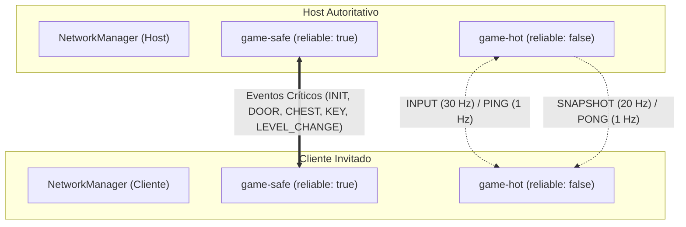

# 13. Canales Duales WebRTC y Endurecimiento de Conexión P0

Este documento detalla la arquitectura de canales duales WebRTC sobre `RTCDataChannel`, la erradicación del bloqueo de cabeza de línea (*Head-of-Line Blocking*), las estrategias de fallback transparente y el endurecimiento P0 de señalización, reintentos y tolerancia a fallos implementados en [`NetworkManager.js`](file:///data/data/com.termux/files/home/develop/game/src/network/NetworkManager.js).

---

## 1. Motivación: El Problema del Head-of-Line Blocking (HoL)

En versiones anteriores basadas en un único canal WebRTC fiable (`reliable: true`), cualquier pérdida de paquetes en conexiones Wi-Fi o datos móviles provocaba un congelamiento en cadena:
1. Si un paquete `SNAPSHOT` o `INPUT` se perdía en la capa de transporte (SCTP sobre DTLS), el receptor retenía todos los paquetes posteriores en su búfer a la espera de la retransmisión del paquete perdido.
2. Esto generaba picos artificiales de latencia de $500\text{ ms}$ a $2000\text{ ms}$, acumulando inputs y produciendo el efecto *rubber-banding* o teletransportes violentos.
3. Tratándose de un juego con simulación a 30 Hz y snapshots a 20 Hz, **un paquete de posición o input perdido carece de valor retrospectivo**: el siguiente frame a los $33\text{ ms}$ o $50\text{ ms}$ ya contiene el estado más reciente.

Para solucionar esto de raíz sin comprometer la fiabilidad de eventos únicos (como abrir un cofre o cambiar de nivel), se diseñó la **Arquitectura de Canales Duales WebRTC**.

---

## 2. Arquitectura de Canales Duales: `game-safe` vs `game-hot`

Cada conexión entre dos pares (Host $\leftrightarrow$ Cliente) negocia dos `RTCDataChannel` independientes con etiquetas bien definidas:



### Especificación de Canales

| Canal | Etiqueta | Opciones WebRTC | Naturaleza | Mensajes Asignados (`MSG`) |
| :--- | :--- | :--- | :--- | :--- |
| **Seguro** | `game-safe` | `reliable: true, ordered: true` | Fiable y ordenado | `INIT` (0x04), `BLOCK` (0x03), `DOOR` (0x05), `PLAYER_META` (0x06), `CHEST_OPEN` (0x07), `HOST_CLOSING` (0x0A), `LEVEL_CHANGE` (0x0B), `KEY` (0x0C), `PEDESTAL` (0x0D), `DESCENT` (0x0E), `STAIRS` (0x0F) |
| **Caliente** | `game-hot` | `reliable: false, maxRetransmits: 0` | No fiable y sin reintentos | `INPUT` (0x01 @ 30 Hz), `SNAPSHOT` (0x02 @ 20 Hz), `PING` (0x08 @ 1 Hz), `PONG` (0x09 @ 1 Hz) |

Constantes en [`src/config/constants.js`](file:///data/data/com.termux/files/home/develop/game/src/config/constants.js):
```javascript
export const NET_CONFIG = {
  INPUT_HZ: 30,
  SNAPSHOT_HZ: 20,
  ROOM_PREFIX: 'VOXELSALA-',
  JOIN_TIMEOUT_MS: 12000,
  JOIN_RETRIES: 2,
  CHANNEL_SAFE: 'game-safe',
  CHANNEL_HOT: 'game-hot',
  HOT_MSGS: [0x01, 0x02, 0x08, 0x09],
};
```

---

## 3. Mecanismo de Enrutado, Fallback y Normalización

### A. Apertura Oportunista y Seguimiento (`_trackLink`)
Durante el handshake de conexión en [`NetworkManager.js`](file:///data/data/com.termux/files/home/develop/game/src/network/NetworkManager.js):
1. El cliente inicia la conexión primaria `game-safe`.
2. Al completarse, lanza inmediatamente una conexión oportunista `game-hot` hacia el mismo peer ID.
3. Si el canal `hot` falla por restricciones de firewall o NAT estricto, el canal `safe` permanece intacto y absorbe el tráfico caliente automáticamente.

El Host y el Cliente gestionan un mapa de enlaces:
```javascript
this._links = new Map(); // peerId -> { safe: DataConnection, hot: DataConnection }
```

### B. Normalización de Claves de Conexión en el Host
En el Host, subsistemas como [`PlayerManager.js`](file:///data/data/com.termux/files/home/develop/game/src/entities/PlayerManager.js) e [`InputQueue.js`](file:///data/data/com.termux/files/home/develop/game/src/network/InputQueue.js) utilizan la conexión como clave de identidad en sus mapas (`Map<Connection, Player>`).

Para evitar duplicidad si un paquete de input llega por el canal `hot`, `_handleIncoming` normaliza siempre la conexión al canal `safe`:
```javascript
const logicalConn = this.isHost ? this._safeForConn(conn) : conn;
m.conn = logicalConn;
this.dispatchEvent(new CustomEvent('input', { detail: m }));
```

### C. Emisión Inteligente con Fallback Automático
- **Broadcast Hot (`broadcastHot`)**: El Host envía snapshots por `link.hot` si está abierto; si aún está abriendo o se cierra, degrada puntualmente a `link.safe` para ese cliente.
- **Cliente a Host Hot (`sendToHostHot`)**: El cliente despacha inputs y pings por `hostHotConn`; si no está listo, utiliza `hostConn`.

---

## 4. Endurecimiento de Red P0

Para garantizar una experiencia sólida en redes móviles inestables y redes Wi-Fi públicas o residenciales, se introdujeron 5 mecanismos de resiliencia:

### 1. Configuración ICE Híbrida (STUN Público + TURN Opcional)
Se configuran múltiples servidores STUN públicos de baja latencia (`stun:stun.l.google.com:19302`, `stun:stun1.l.google.com:19302`). Asimismo, se admite inyección de credenciales TURN personalizadas vía `localStorage` para eludir routers simétricos o redes celulares restrictivas:
- `dungeon_turn_url`
- `dungeon_turn_user`
- `dungeon_turn_pass`

### 2. Recuperación Automática ante Colisión de PIN en el Host
Al crear sala, si el identificador PIN de 4 dígitos ya estuviera en uso en el servidor de señalización de PeerJS (`unavailable-id`), `host()` captura el error e intenta automáticamente generar un nuevo PIN aleatorio hasta un máximo de 5 intentos antes de reportar error al usuario.

### 3. Timeout y Reintentos Automáticos al Unirse (`joinRoom`)
El método `join()` en [`NetworkManager.js`](file:///data/data/com.termux/files/home/develop/game/src/network/NetworkManager.js) implementa un temporizador de desconexión estricto de **12 segundos** (`JOIN_TIMEOUT_MS = 12000`). En [`main.js`](file:///data/data/com.termux/files/home/develop/game/src/main.js), `joinRoom()` ejecuta automáticamente hasta 2 intentos con un intervalo de espera de $1200\text{ ms}$ antes de informar al usuario.

### 4. Traducción Amigable de Errores de Red
Se implementó `NetworkManager.translatePeerError(err)` para mapear excepciones crípticas de WebRTC a instrucciones en español claro:
- `peer-unavailable`: "La mazmorra con ese PIN no existe o el anfitrión se ha desconectado."
- `network`: "Fallo en la conexión de red. Comprueba tu conexión a Internet o Wi-Fi."
- `server-error`: "El servidor de emparejamiento no responde. Inténtalo de nuevo."
- `browser-incompatible`: "Tu navegador no soporta WebRTC o DataChannel."

### 5. Diagnóstico de Enlace en Tiempo Real (`getLinkInfo`)
La API expone `network.getLinkInfo()` para telemetría y depuración en pantalla:
- **En el Host**: Cantidad de peers conectados, peers con canal hot activo y flag de fallback (`fallback: hotPeers < totalPeers`).
- **En el Cliente**: Estado de `safeOpen`, `hotOpen` y detección de operación en modo seguro fallback.

---

## 5. Verificación de Regresión

La suite de pruebas automatizadas en [`tests/network-channels.test.js`](file:///data/data/com.termux/files/home/develop/game/tests/network-channels.test.js) valida continuamente:
- Pertenencia estricta de `INPUT`, `SNAPSHOT`, `PING` y `PONG` a `HOT_MSGS`.
- Exclusión total de eventos críticos (`INIT`, `DOOR`, `CHEST`, `KEY`, `LEVEL_CHANGE`) del canal no fiable.
- Coexistencia y diferenciación de nombres de canal (`game-safe` vs `game-hot`).
- Parámetros de timeout (12 s) y reintentos automáticos.
