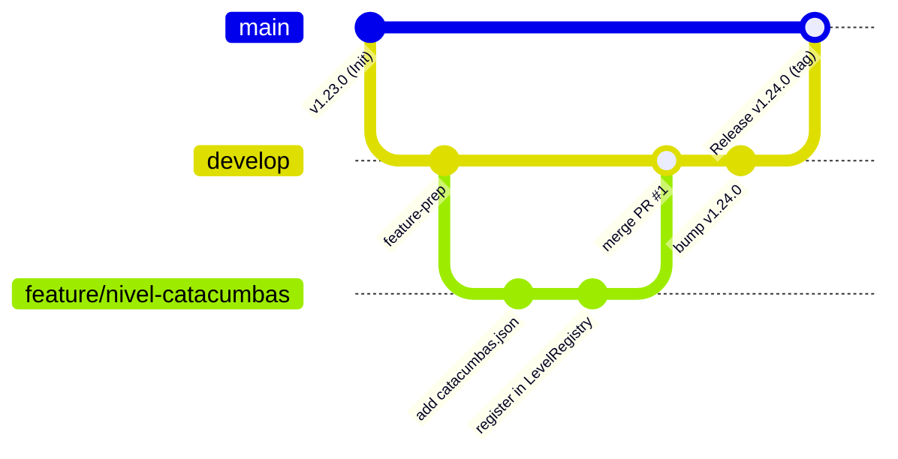

# 15. Flujo de Trabajo Git y Creación de Nuevos Niveles de Mazmorra

Este documento establece la metodología de control de versiones Git, el flujo de ramas (**GitFlow simplificado**), el protocolo de integración continua y la guía paso a paso para diseñar, validar y registrar nuevos niveles de mazmorra en **Runa y Piedra**.

---

## 1. Topología de Ramas y Política de Integración

El repositorio oficial en GitHub ([`erickaguilar/runa-y-piedra`](https://github.com/erickaguilar/runa-y-piedra)) opera bajo dos ramas perennes protegidas y ramas efímeras de funcionalidad:



### Ramas Principales

| Rama | Propósito | Reglas |
| :--- | :--- | :--- |
| **`main`** | **Producción y Versiones Estables**: Refleja siempre el código desplegable y en producción. | Solo recibe fusiones (*merges*) desde `develop` o `hotfix/*`. Cada actualización lleva un tag de versión (`v1.x.y`). |
| **`develop`** | **Integración Continua**: Rama de trabajo diario donde convergen todas las características probadas. | Base para crear ramas `feature/*`. Debe mantenerse en estado verde (`npm test` superado). |

### Ramas de Soporte Efímeras

* **`feature/<nombre-descriptivo>`**: Para nuevos niveles, mecánicas o mejoras de red (ej. `feature/nivel-cripta-sombras`, `feature/trampa-pinchos`). Nacen y mueren en `develop`.
* **`hotfix/<nombre-error>`**: Para correcciones críticas de producción que no pueden esperar al ciclo normal de `develop`. Nacen de `main` y se fusionan simultáneamente en `main` y `develop`.

---

## 2. Guía Paso a Paso: Creación de un Nuevo Nivel

El motor de niveles de Runa y Piedra está completamente desacoplado en formato declarativo JSON dentro de [`src/levels/data/`](file:///data/data/com.termux/files/home/develop/game/src/levels/data/).

### Paso 1: Crear la Rama de Funcionalidad
Desde una copia local actualizada de `develop`:
```bash
git checkout develop
git pull origin develop
git checkout -b feature/nivel-cripta-sombras
```

### Paso 2: Diseñar el Escenario en JSON
Crear el archivo `src/levels/data/cripta_sombras.json` siguiendo el esquema arquitectónico:

```json
{
  "id": "cripta_sombras",
  "name": "Cripta de las Sombras",
  "dimensions": { "width": 24, "height": 16, "depth": 36 },
  "spawn": { "x": 12.0, "y": 1.2, "z": 4.5, "yaw": 0.0 },
  "checkpoints": [
    { "zMin": 0.0, "zMax": 11.0, "spawn": { "x": 12.0, "y": 1.2, "z": 4.5 }, "message": "Reapareciendo en Vestíbulo Sombrío..." },
    { "zMin": 11.0, "zMax": 24.0, "spawn": { "x": 11.5, "y": 1.2, "z": 12.0 }, "message": "Reapareciendo en el Foso..." },
    { "zMin": 24.0, "zMax": 36.0, "spawn": { "x": 11.5, "y": 1.2, "z": 25.0 }, "message": "Reapareciendo en el Altar..." }
  ],
  "doors": [
    { "doorId": 1, "x": 11, "y": 1, "z": 11, "requiresKey": false },
    { "doorId": 2, "x": 11, "y": 1, "z": 24, "requiresKey": true }
  ],
  "chests": [
    { "chestId": 1, "x": 15, "y": 1, "z": 5, "givesKey": true, "loot": "Llave Sombría" }
  ],
  "stairs": {
    "x": 11, "y": 0, "z": 32, "targetLevelId": "abyss_throne", "openFromStart": false
  },
  "pedestal": null
}
```

### Paso 3: Registrar el Nivel en [`LevelRegistry.js`](file:///data/data/com.termux/files/home/develop/game/src/levels/LevelRegistry.js)
Importar el JSON con atributos de tipo y añadirlo al catálogo:

```javascript
import criptaSombras from './data/cripta_sombras.json' with { type: 'json' };

// En el constructor:
this.registerLevel(criptaSombras);
```

### Paso 4: Validar Físicas, Sensores y Regresión
Antes de realizar cualquier commit, es **estrictamente obligatorio** ejecutar la suite nativa de tests:

```bash
npm test
```
El test [`tests/levels.test.js`](file:///data/data/com.termux/files/home/develop/game/tests/levels.test.js) inspeccionará automáticamente la consistencia estructural del nuevo archivo JSON:
- Verificación de umbrales bajo puertas (`MIN_Y`).
- Sellado perimetral impenetrable.
- Correspondencia lógica de cofres con llaves y puertas con cerradura.
- Correcta apertura o sellado de escalinatas de descenso.

Comprobar además la compilación de producción con Vite:
```bash
npm run build
```

---

## 3. Convención de Commits y Fusión a `develop`

Utilizar el estándar **Conventional Commits**:
- `feat: añadir nivel Cripta de las Sombras con losa de descenso rúnica`
- `fix: corregir posición de cofre en sala 2 de dungeon_classic`
- `docs: actualizar documentación de niveles en docs/08`
- `test: agregar test de colisión para jump pads en ángulo`

```bash
git add src/levels/data/cripta_sombras.json src/levels/LevelRegistry.js
git commit -m "feat: nuevo nivel de mazmorra Cripta de las Sombras"
git push -u origin feature/nivel-cripta-sombras
```

Luego, en GitHub, se abre un Pull Request hacia la rama **`develop`**. Tras la revisión y aprobación, se realiza el merge y se elimina la rama efímera.

---

## 4. Publicación de Versión (Release hacia `main`)

Cuando un conjunto de niveles o características en `develop` conforma un hito jugable:

1. **Incrementar versión y documentar**:
   - Actualizar `"version"` en [`package.json`](file:///data/data/com.termux/files/home/develop/game/package.json).
   - Documentar adiciones, cambios o correcciones en [`CHANGELOG.md`](file:///data/data/com.termux/files/home/develop/game/CHANGELOG.md).
   - Actualizar el badge en [`README.md`](file:///data/data/com.termux/files/home/develop/game/README.md).
2. **Fusionar en `main`**:
   ```bash
   git checkout main
   git pull origin main
   git merge develop --no-ff -m "chore: release v1.24.0"
   git tag -a v1.24.0 -m "Versión 1.24.0: Nuevas mazmorras y optimizaciones"
   git push origin main --tags
   ```
3. **Re-sincronizar `develop`**:
   ```bash
   git checkout develop
   git merge main
   git push origin develop
   ```
