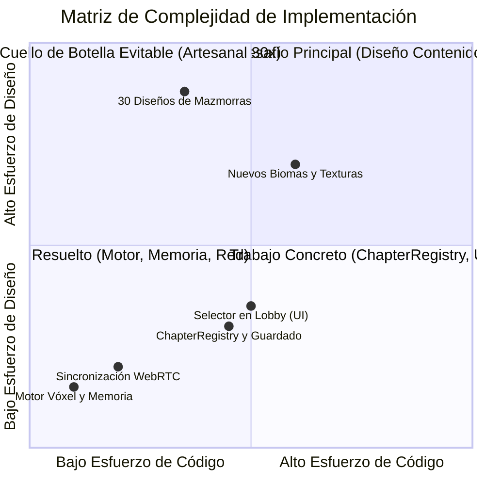
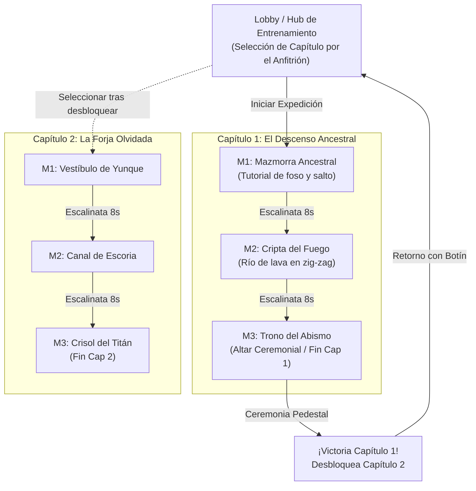
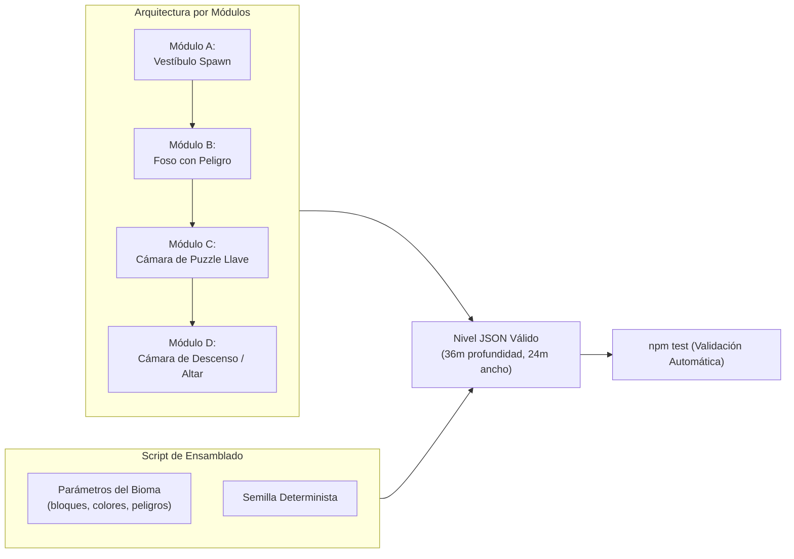

# 17. Arquitectura de Capítulos y Escalado de Mazmorras (10 Capítulos × 3 Niveles)

Este documento analiza la viabilidad técnica, el diseño de sistemas, el consumo de recursos, la taxonomía de biomas y la hoja de ruta para evolucionar **Runa y Piedra** desde una secuencia lineal de niveles hasta una campaña de **10 capítulos con 3 mazmorras cada uno (30 niveles en total)**.

---

## 1. Evaluación de Viabilidad y Matriz de Complejidad

La adición de 30 mazmorras distribuidas en 10 capítulos no representa un desafío a nivel de motor de juego ni de infraestructura de red, sino un reto de **diseño de niveles y variedad de mecánicas**.



### Calificación por Áreas
| Área | Dificultad | Estado / Diagnóstico |
| :--- | :---: | :--- |
| **Motor de Vóxeles y Render** | **1 / 10** | **100% Preparado**. Carga y desmonta mundos en milisegundos sin fugas de memoria. |
| **Protocolo de Red WebRTC** | **2 / 10** | **100% Preparado**. Mensajes dinámicos `LEVEL_CHANGE`, `DESCENT_START` y `DESCENT_GO` desacoplados de identificadores estáticos. |
| **Presupuesto de Memoria y Red** | **1 / 10** | **Despreciable**. 30 archivos JSON pesan $\approx 150\text{ KB}$ sin comprimir ($\approx 35\text{ KB}$ comprimidos en gzip de Vite). Solo 1 mapa reside en memoria gráfica al mismo tiempo. |
| **Arquitectura de Capítulos y UI** | **4 / 10** | **Requiere desarrollo simple** (1 a 2 días): migrar de lista plana a `ChapterRegistry`, atril de selección en el Lobby y persistencia en `localStorage`. |
| **Diseño de Juego y Variedad** | **7 / 10** | **El desafío real**: evitar que 30 niveles se vuelvan monótonos introduciendo 10 biomas distintivos y mecánicas/peligros ambientales progresivos. |

---

## 2. Presupuesto Técnico y Cero Degradación de Rendimiento

### 2.1. Gestión de Memoria en el Cliente
El motor de vóxeles de *Runa y Piedra* opera bajo el principio de **instanciación efímera de nivel único**:

- La matriz tridimensional (`World.js`) de un nivel estándar ($24 \times 16 \times 36$ bloques) ocupa únicamente **13.8 KB de memoria RAM**.
- Al conmutar de nivel mediante `switchLevel()`:
  1. Se purgan las geometrías Three.js anteriores mediante `voxelMap.rebuildFromWorld()`.
  2. Se limpian los renderizadores de cofres, puertas, escalinatas y pedestales.
  3. Se reinician los buffers del reconciliador (`reconciler.reset()`) y la cola de inputs (`inputQueue.clear()`).
- Por tanto, **el juego consume exactamente la misma cantidad de RAM jugando 3 niveles que jugando 30 niveles**.

### 2.2. Tamaño del Bundle y Tiempos de Carga
Todos los niveles se serializan en formato declarativo JSON compacto (`src/levels/data/*.json`).
- Peso promedio por archivo de nivel: **$4.5\text{ KB}$**.
- 30 niveles $\times 4.5\text{ KB} = \mathbf{135\text{ KB}}$.
- Tras la minificación y compresión gzip en la compilación de Vite (`npm run build`), el peso añadido al bundle es inferior a **$30\text{ KB}$**, lo que garantiza que los tiempos de carga en dispositivos móviles bajo redes 4G o Wi-Fi sigan siendo prácticamente instantáneos.

---

## 3. Arquitectura del Sistema Capitular (`ChapterRegistry`)

Actualmente, [`LevelRegistry.js`](file:///data/data/com.termux/files/home/develop/game/src/levels/LevelRegistry.js) mantiene una lista plana de niveles. Para estructurar capítulos, se introduce un modelo jerárquico:



### 3.1. Estructura de Datos Declarativa
```javascript
// src/levels/ChapterRegistry.js
export const CHAPTER_CATALOG = [
  {
    id: 'capitulo_1',
    number: 1,
    name: 'El Descenso Ancestral',
    theme: 'ancient_stone',
    lore: 'Antiguas cámaras de sillar milenario y corrientes de magma primigenio.',
    icon: 'castle',
    dungeons: [
      { id: 'dungeon_classic', role: 'intro' },
      { id: 'crypt_inferno',  role: 'challenge' },
      { id: 'abyss_throne',   role: 'climax' }
    ]
  },
  {
    id: 'capitulo_2',
    number: 2,
    name: 'Las Minas Sombrías',
    theme: 'dark_mines',
    lore: 'Galerías apuntaladas con vigas de roble y fosas sin fondo.',
    icon: 'pickaxe',
    dungeons: [
      { id: 'mines_shaft',   role: 'intro' },
      { id: 'mines_chasm',   role: 'challenge' },
      { id: 'mines_treasury', role: 'climax' }
    ]
  }
  // ... capítulos 3 a 10
];
```

### 3.2. Roles Canónicos dentro de cada Capítulo
Cada capítulo de 3 mazmorras sigue una curva de tensión dramática y dificultad de juego probada:

1. **Mazmorra 1 (Introducción / Exploración)**:
   - Introduce la paleta visual y el ambiente sonoro del nuevo bioma.
   - Puzzles directos: 1 llave, 1 cofre, 1 puerta.
   - Saltos de baja penalización para calibrar distancias.
2. **Mazmorra 2 (Desafío / Tensión Mecánica)**:
   - Foso extenso con el peligro característico del bioma (lava, ácido, vacío, hielo).
   - Secciones de parkour sincronizado con plataformas estrechas o móviles.
   - Checkpoints estratégicos entre salas para premiar el avance parcial.
3. **Mazmorra 3 (Clímax / Altar Ceremonial)**:
   - Escenario monumental o sala de trono.
   - Sin escalinata de descenso adicional.
   - En su lugar aloja el **Pedestal Rúnico** con orbe de activación.
   - Al interactuar ambos jugadores, se dispara la fanfarria de cierre de capítulo, se otorgan gemas legendarias, se desbloquea el siguiente capítulo en `localStorage` y se regresa al Lobby.

---

## 4. Taxonomía de los 10 Capítulos: Biomas y Nuevas Mecánicas

Para que una campaña de 30 mazmorras mantenga el interés de los jugadores, cada capítulo debe poseer **identidad visual propia** e introducir **un peligro o mecánica física nueva**:

| Cap. | Nombre del Capítulo | Bioma y Paleta Visual | Mecánica o Peligro Ambiental Exclusivo |
| :---: | :--- | :--- | :--- |
| **1** | **El Descenso Ancestral** *(Actual)* | Sillar de piedra (#252a32), musgo verde y fosa de lava ardiente | Plataformas de salto rúnico (*Jump Pads*, $v_y = 12\text{ m/s}$) y losas de presión. |
| **2** | **Cripta de las Sombras** | Basalto negro, runas violetas, niebla densa | Antorchas mágicas que revelan bloques de suelo invisibles al acercarse. |
| **3** | **Cataratas Subterráneas** | Piedra caliza húmeda, acueductos y agua corriente | Corrientes de agua que empujan lateralmente al aventurero si no contrarresta con marcha. |
| **4** | **La Gran Forja Enana** | Ladrillos de hierro forjado, brasas y engranajes | Cilindros/pistones que bajan periódicamente aplastando la casilla inferior si no se cruza a tiempo. |
| **5** | **Cuevas de Escarcha y Hielo** | Bloques translúcidos de hielo azul y estalactitas | Suelo con fricción reducida ($\mu = 0.05$): el avatar patina conservando inercia al girar y saltar. |
| **6** | **Catacumbas del Moho Venenoso** | Roca cubierta de líquenes, lodo verde y niebla tóxica | Fosas de ácido pantanoso: no causan muerte instantánea, pero drenan 1 vida si permaneces más de 2 segundos. |
| **7** | **Templo Arcano Olvidado** | Mármol blanco refinado, detalles dorados y energía cian | Portales rúnicos de teletransporte instantáneo entre extremos desconectados de la sala. |
| **8** | **Minas Profundas de Carbón** | Vigas de madera carcomida y rocas agrietadas | Bloques de suelo frágiles: tiemblan y se desmoronan a los 0.8 segundos de pisarlos. |
| **9** | **Prisión Flotante del Vacío** | Monolitos suspendidos en el cosmos, sin paredes | Parkour de alta precisión sin paredes laterales; cualquier desvío es caída definitiva al vacío. |
| **10** | **El Núcleo del Titán Rúnico** | Obsidiana pura pulida y magma dorado | Desafío supremo cooperativo: múltiples interruptores que deben mantenerse presionados por ambos jugadores a la vez. |

---

## 5. Hub de Selección y Persistencia

### 5.1. El Lobby como Centro de Operaciones
El nivel actual [`lobby_tutorial.json`](file:///data/data/com.termux/files/home/develop/game/src/levels/data/lobby_tutorial.json) se expande como el punto de reunión de la expedición:
- Se añade un **Monolito de Cartografía** (objeto interactivo con tecla E / botón USAR).
- Al interactuar el Anfitrión, se abre un modal de cuadrícula con los 10 capítulos:
  - Capítulos desbloqueados: muestran icono, nombre y estadísticas (mejor tiempo, muertes).
  - Capítulos bloqueados: muestran silueta en gris y candado.
- El Anfitrión selecciona el capítulo; el evento se transmite a los clientes mediante el mensaje de red `CHAPTER_SELECT`.

### 5.2. Persistencia en `localStorage`
El progreso se almacena localmente de forma resiliente:
```json
{
  "runa_campaign_progress": {
    "highestChapterUnlocked": 3,
    "completedChapters": ["capitulo_1", "capitulo_2"],
    "records": {
      "capitulo_1": { "bestTimeSec": 245, "deaths": 1, "stars": 3 },
      "capitulo_2": { "bestTimeSec": 310, "deaths": 2, "stars": 2 }
    }
  }
}
```

---

## 6. Estrategia de Producción: Manual vs Generación por Plantillas

Crear 27 niveles adicionales a mano escribiendo arrays de coordenadas JSON llevaría entre 30 y 45 horas. Para optimizar el tiempo de desarrollo manteniendo la máxima calidad:



### Enfoque Recomendado: Ensamblador de Salas Modulares
1. Diseñar 5 variantes modulares de cada sala:
   - 5 salas de inicio (Vestíbulo).
   - 8 salas intermedias de habilidad (parkour, puentes rotos, pasarelas zig-zag).
   - 4 salas de bifurcación con cofres y cerraduras.
   - 3 salas finales (escalinata o altar).
2. Un script en Node.js (`tools/generate-chapter.js`) combina las salas preconfiguradas aplicando la paleta de bloques de cada capítulo y exporta los archivos `.json` automáticamente.
3. El test de integración [`tests/levels.test.js`](file:///data/data/com.termux/files/home/develop/game/tests/levels.test.js) verifica automáticamente que los niveles generados cumplan todas las reglas:
   - Umbrales sellados contra el abismo exterior.
   - Distancias de salto físicamente alcanzables ($d \le 3.8\text{ m}$ con salto simple, $d \le 7.0\text{ m}$ con Jump Pad).
   - Existencia de llave para cada puerta bloqueada.

---

## 7. Hoja de Ruta de Implementación por Fases

1. **Fase 1: Formalización de la Arquitectura de Capítulos**
   - Crear `src/levels/ChapterRegistry.js` registrando el **Capítulo 1: El Descenso Ancestral** con las 3 mazmorras existentes (`dungeon_classic`, `crypt_inferno`, `abyss_throne`).
   - Adaptar `DescentManager.js` para detectar el final del capítulo tras el altar de `abyss_throne` y ofrecer regreso triunfal al Lobby.

2. **Fase 2: Interfaz de Selección en el Lobby y Persistencia**
   - Implementar el modal de selección de capítulos en `UIManager.js`.
   - Guardar y leer progreso en `localStorage`.
   - Sincronizar el capítulo seleccionado por el anfitrión a todos los pares WebRTC.

3. **Fase 3: Expansión de Biomas y Mecánicas (Capítulos 2 y 3)**
   - Añadir texturas y bloques para *Las Minas Sombrías* (madera, bloques quebradizos) y *Las Cuevas de Escarcha* (hielo deslizante).
   - Diseñar y registrar las 6 nuevas mazmorras correspondientes.

4. **Fase 4: Despliegue de los Capítulos 4 al 10**
   - Utilizar el generador modular de escenarios para compilar y validar los 21 niveles restantes.
   - Realizar la ronda completa de verificación mediante el protocolo de [Smoke Test](./smoke-test.md).
