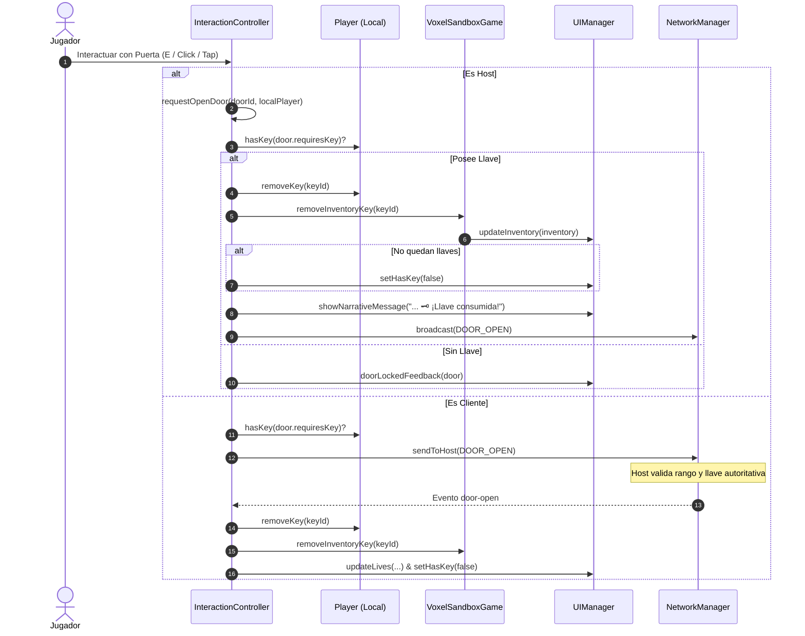

# 18. Sistema de Inventario, HUD Expandido y Herramientas de Desarrollo

> **Versión del documento**: 1.0.0  
> **Fecha de actualización**: 30 de septiembre de 2026  
> **Módulos relacionados**: [`src/ui/UIManager.js`](../src/ui/UIManager.js), [`src/ui/Icons.js`](../src/ui/Icons.js), [`src/controllers/InteractionController.js`](../src/controllers/InteractionController.js), [`src/entities/Player.js`](../src/entities/Player.js), [`src/main.js`](../src/main.js), [`index.html`](../index.html)

---

## 1. Visión General y Objetivos

Con el crecimiento de *Runa y Piedra* y la introducción de múltiples mazmorras con botines acumulativos (llaves de cerradura, gemas arcanas y reliquias míticas), la interfaz de usuario (UI) y la experiencia de usuario (UX) requerían una evolución arquitectónica para resolver los siguientes problemas:

1. **Visibilidad Inmediata del Estado del Aventurero**: El jugador necesita consultar de un vistazo sus vidas actuales, si transporta una llave de mazmorra activa y cuántas gemas ha recolectado, sin interrumpir el flujo de juego.
2. **Representación Clara de Daño y Vidas Perdidas**: Sustituir el oscurecimiento genérico por el contorno estilizado (*outline*) de los corazones vacíos, manteniendo la escala geométrica y la animación reactiva de impacto (*shake*).
3. **Consumo Autoritativo de Objetos**: Cuando una llave es utilizada para abrir una puerta sellada, debe eliminarse de la entidad del jugador, consumirse del inventario del juego, reflejarse en tiempo real en el HUD y sincronizarse entre pares WebRTC sin generar estados fantasma.
4. **Inspección Profunda de Botín (Inventario Modal)**: Proveer un modal temático accesible mediante un botón compacto con insignia numérica o pulsando la tecla `B` en PC.
5. **Herramientas de Diagnóstico y Desarrollo Exclusivas**: Disponer de un botón de recarga rápida (F5 táctil) y telemetría de red visible exclusivamente en entornos de desarrollo local (`npm run dev`), sin ensuciar la interfaz en producción.
6. **Inmersión Temática y Supresión de Diálogos Nativos**: Eliminar `alert()` y `confirm()` del navegador para salidas al menú o confirmaciones, sustituyéndolos por modales vectoriales con estética *dark fantasy*.

---

## 2. Arquitectura del HUD Superior Izquierdo (`#hud-top-left`)

El contenedor superior izquierdo agrupa los componentes de estado en una fila elástica continua (`.hud-top-row`):

```
+---------------------------------------------------------------------------------+
|  [ 📦 3 ]   [ ❤️  ❤️  🖤(outline)  |  🗝️  |  💎 100 ]                          |
|  (#hud-inv) (#hud-lives)                                                        |
+---------------------------------------------------------------------------------+
```

### 2.1 Botón de Inventario de Botín (`#hud-inventory`)
- **Posición**: Ubicado a la izquierda del HUD de vidas.
- **Dimensiones**: Botón cuadrado de $38 \times 38\text{ px}$ con esquinas redondeadas ($12\text{ px}$), fondo de vidrio translúcido con desenfoque de fondo (`backdrop-filter: blur(10px)`).
- **Icono Central**: Icono vectorial SVG de cofre (`chest`). Se ilumina en ámbar dorado (`#fbbf24`) cuando hay tesoros recolectados y permanece en gris tenue (`#94a3b8`) cuando el inventario está vacío.
- **Insignia Numérica (`.inv-btn-badge`)**: Contador flotante en la esquina superior derecha que muestra el total de tesoros (`llaves + (gemas > 0 ? 1 : 0) + reliquias`). Se actualiza reactivamente con física de resorte (*spring pop-in*).
- **Atajos**: Clic / toque directo en pantalla o tecla `B` en teclado PC.

### 2.2 Barra de Estado Integral (`#hud-lives`)
El contenedor `#hud-lives` integra en un único módulo visual tres elementos esenciales:

#### A. Corazones de Vida con Contorno Vacío
- Cada vida restante se renderiza con el icono vectorial relleno `heart` en rojo carmesí (`#ef4444`).
- Cada vida perdida se renderiza con el icono vectorial `heartOutline` en tono pizarra neutro (`#64748b`), con `fill="none"` y `stroke="currentColor" stroke-width="2"`.
- Ambos iconos comparten la **misma curva matemática de Bézier** ($24 \times 24\text{ px}$ con vértice inferior en `(12, 21.23)` y hendidura superior en `(12, 5.67)`), garantizando una transición visual perfecta entre el estado vivo y perdido.
- Al recibir daño o caer al abismo, el corazón recién perdido ejecuta la animación `@keyframes heartShake` (escalado elástico y rotación de $-8^\circ$).

#### B. Insignia de Llave de Mazmorra (`.key-badge`)
- Solo se muestra si el jugador posee al menos una llave activa (`this._hasKey === true`).
- Separada de los corazones por una línea divisoria vertical sutil (`border-left: 1px solid rgba(255,255,255,0.15)`).
- Icono dorado de llave (`#fbbf24`) con halo de resplandor suave.
- Interactiva: al tocarla o hacerle clic, abre directamente el modal de inventario.

#### C. Contador de Gemas en Vivo (`.gems-badge`)
- Muestra el icono de gema azul cielo (`gem`, `#38bdf8`) junto a la cantidad numérica actual (`.gems-count`).
- Tipografía numérica tabular (`font-variant-numeric: tabular-nums`) para evitar oscilaciones de ancho al cambiar de cifra.
- Sincronizado automáticamente por `updateInventory()` cada vez que se recolectan gemas en un cofre o se reinicia la partida.
- Interactiva: al tocarla o hacerle clic, abre el modal de inventario para ver el historial y desglose.

### 2.3 Pila de Notificaciones y Alertas Narrativas (`#hud-message`)
- **Prioridad Visual Absoluta (`z-index: 9999`)**: Ubicado al final del árbol DOM y con el valor de capa más alto de la aplicación, garantizando que ninguna ventana modal, velo de transición (`#level-transition`) ni interfaz tape los avisos.
- **Descarte Rápido Interactivo**: Las tarjetas de alerta (`.hud-alert-card`) pueden ser descartadas instantáneamente tocándolas o haciendo clic sobre ellas, sin tener que esperar a que expire el temporizador automático.
- **Mensaje de Bienvenida Depurado**: Se eliminó la indicación obsoleta de "cambiar mapa" en el anfitrión (`🏰 [Nivel] (PIN: [XXXX]). Toca ⚙️ para invitar amigos.`), alineando la narrativa con la progresión ceremonial y cooperativa por descenso.

---

## 3. Ciclo de Vida y Consumo de Llaves

En la versión previa, las llaves se almacenaban en la entidad `Player` y en el inventario, pero no se consumían al ser utilizadas para abrir puertas selladas. En la versión 1.24.0, el consumo es autoritativo y bidireccional (Host y Cliente):



### Métodos Clave Implementados:
- **`Player.prototype.removeKey(keyId)`**: Localiza el índice de la llave en `this.keys` y la elimina mediante `splice(idx, 1)`. Retorna `true` si fue removida.
- **`VoxelSandboxGame.prototype.removeInventoryKey(keyId)`**: Remueve la llave de `this.inventory.keys` (soportando tanto IDs en texto como objetos `{ id, name }`) y dispara reactivamente `ui.updateInventory(this.inventory)`.
- **`VoxelSandboxGame.prototype.removeInventoryRelic(relicId)`**: Extensión preparada para futuras mecánicas de sacrificio u ofrendas en altares arcanos.

---

## 4. Modal de Inventario y Botín (`#modal-inventory-overlay`)

Al interactuar con `#hud-inventory` o pulsar `B`:
1. Se abre una capa superpuesta con fondo de penumbra (`rgba(5, 8, 16, 0.8)`) y tarjeta central con borde dorado rúnico.
2. **Secciones de Contenido**:
   - **Llaves de Mazmorra**: Lista de llaves con insignia de estado `Activa` e indicación de puerta a la que corresponden.
   - **Tesoro en Gemas**: Tarjeta destacada con contador numérico azul cielo y denominación de tesoro.
   - **Reliquias Míticas**: Reliquias legendarias recolectadas (*Cáliz Sagrado*, *Corazón del Volcán*, *Corona del Vacío*) con icono temático y descripción ancestral.
3. **Estado Vacío**: Si el aventurero aún no ha abierto cofres, se muestra una ilustración temática con icono de cofre atenuado y un mensaje de exploración.
4. **Cierre Amigable**: Botón de cierre en la cabecera, tecla `Escape`, tecla `B` o clic fuera del modal.

---

## 5. Herramientas de Desarrollo y Diagnóstico (`#modal-dev`)

Para acelerar las pruebas multijugador y de rendimiento en dispositivos móviles sin necesidad de conectar consolas remotas por USB/ADB, se implementó un módulo exclusivo para desarrollo:

```mermaid
flowchart TD
    Init[Inicio de UIManager] --> CheckDev{¿Es Entorno Dev?}
    CheckDev -- "import.meta.env.DEV == true" --> ShowBtn[Mostrar Botón 🛠️ #btn-dev]
    CheckDev -- "hostname == localhost / 127.0.0.1" --> ShowBtn
    CheckDev -- Producción / Vercel --> HideBtn[Ocultar Botón display: none]

    ShowBtn --> ClickDev[Clic en #btn-dev]
    ClickDev --> OpenModal[Abrir #modal-dev]
    OpenModal --> ActionReload[Botón 'Reiniciar Partida (F5)' -> Recarga limpia de sesión]
    OpenModal --> ActionNet[Panel de Telemetría WebRTC -> Ping, Jitter, Safe/Hot]
```

### Características de `#modal-dev`:
- **Seguridad**: Totalmente oculto e inactivo en compilaciones de producción.
- **Botón "Reiniciar Partida (F5)"**: Permite reiniciar inmediatamente el juego en navegadores móviles donde no existe la tecla F5 ni barra de herramientas accesible en modo pantalla completa.
- **Inspección de Conectividad**: Acceso directo al monitor de estadísticas de red en tiempo real.

---

## 6. Diálogo Temático de Confirmación para Salir

Anteriormente, al pulsar "Salir al Menú Principal" en el modal de configuración, se invocaba `window.confirm()`. Esto causaba bloqueos de hilos en algunos navegadores móviles e interrumpía el contexto WebGL.

- Se implementó `openConfirmDialog({ title, message, confirmText, cancelText, onConfirm, onCancel })` en [`UIManager.js`](../src/ui/UIManager.js).
- Renderiza un diálogo flotante modal con temática *dark fantasy*, bordes rúnicos ambarinos, botón de cancelación neutral y botón de confirmación de peligro en rojo carmesí (`#ef4444`).
- Integra efectos sonoros sintetizados procedimentales (`playClick()` y `playMenuClose()`).

---

## 7. Personalización de Barras de Desplazamiento y Orientación Inicial

### 7.1 Scrollbars Temáticos en CSS
Se personalizaron las barras de desplazamiento en WebKit / Blink y Firefox para integrarse con la estética del juego:
- **Ancho**: $6\text{ px}$ compacto.
- **Pista (`track`)**: Fondo obsidiana semi-transparente (`rgba(15, 23, 42, 0.6)`).
- **Control deslizante (`thumb`)**: Gris pizarra oscuro (`#334155`) con transición a ámbar rúnico (`#f59e0b`) en estado *hover*.

### 7.2 Versión Dinámica del Proyecto
El pie del modal de configuración (`#modal-settings`) muestra dinámicamente la versión activa del juego obtenida desde [`constants.js`](../src/config/constants.js) (`APP_CONFIG.VERSION`), garantizando coherencia absoluta entre el código, los paquetes y la interfaz.

### 7.3 Orientación Inicial a 180° (`Math.PI`)
Al generar un nuevo nivel o iniciar una partida, la rotación horizontal del jugador (`player.yaw` e `input.yaw`) se inicializa en $180^\circ$ ($\pi\text{ rad}$). Esto asegura que el personaje inicie **mirando hacia el pasillo y salas de la mazmorra**, en lugar de aparecer de frente contra la pared trasera del punto de aparición.

---

## 8. Verificación y Cobertura de Pruebas

Toda la funcionalidad está respaldada por la suite de pruebas unitarias (`node:test`):

1. **`tests/icons.test.js`**:
   - Conversión de emojis `🤍` y `🖤` al icono vectorial `heartOutline`.
   - Validación del marcado SVG: `fill="none"` y `stroke="#64748b"`.
2. **`tests/inventory.test.js`**:
   - Extracción de botín en cofres.
   - Consumo de llaves al abrir puertas selladas (`requestOpenDoor`).
   - Sincronización de flags y mensaje narrativo `🗝️ ¡Llave consumida!`.
3. **`tests/ui-manager.test.js`**:
   - Renderizado de contorno en corazones perdidos (`heartOutline`).
   - Retención de la insignia de llave en `#hud-lives`.
   - Contador de gemas reactivo en tiempo real.
   - Control de visibilidad del botón de desarrollo `#btn-dev`.
   - Apertura y cierre del diálogo temático de confirmación de salida.
4. **`tests/player.test.js`**:
   - Orientación inicial a 180° (`p.yaw === Math.PI`).
   - Métodos de gestión de llaves: `addKey`, `hasKey`, `removeKey`, `clearKeys`.
