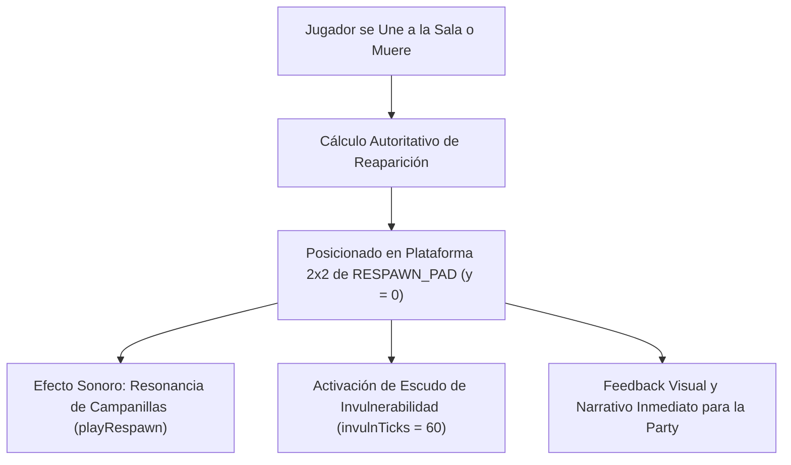

# 20. Bloques de Respawn y Losas de Aparición Rúnica

## 1. Resumen Ejecutivo y Motivación

En **Runa & Piedra**, el sistema de aparición y reaparición de aventureros previamente utilizaba coordenadas flotantes virtuales (`spawn: { x: 12.0, y: 1.2, z: 4.5 }`) sobre losas estándar de adoquín común. Esto dificultaba que tanto el anfitrión como los invitados supieran visualmente dónde se materializarían los nuevos compañeros al unirse a la sala o dónde reaparecerían tras caer en la lava o en el abismo.

Con la versión **v1.26.0**, se introduce el **Bloque de Respawn / Losa Rúnica de Aparición** (`BLOCK_TYPES.RESPAWN_PAD = 11`), un bloque sólido especializado de sillar de basalto oscuro con glifo circular de invocación en color **azul cian radiante** (`#38bdf8`), halo místico de almas y una mecánica exclusiva de **Santuario de Reaparición Segura**.



---

## 2. Especificación del Bloque `RESPAWN_PAD`

| Propiedad | Valor / Definición | Archivo de Origen |
| :--- | :--- | :--- |
| **Identificador Numérico** | `BLOCK_TYPES.RESPAWN_PAD = 11` | [`src/config/constants.js`](file:///data/data/com.termux/files/home/develop/game/src/config/constants.js) |
| **Color Base del Atlas** | `0xffffff` (neutro para respetar tintes SVG) | [`src/config/constants.js`](file:///data/data/com.termux/files/home/develop/game/src/config/constants.js) |
| **Casilla en el Texture Atlas** | **Tile 11** (Fila 2, Columna 3 en la matriz 4x4) | [`src/render/TextureGenerator.js`](file:///data/data/com.termux/files/home/develop/game/src/render/TextureGenerator.js) |
| **Mapeo de Coordenadas UV** | `u: 0.75, v: 0.50` | [`src/render/VoxelMap.js`](file:///data/data/com.termux/files/home/develop/game/src/render/VoxelMap.js) |
| **Comportamiento Físico** | Sólido colisionable (`isSolid === true`) | [`src/core/PhysicsAABB.js`](file:///data/data/com.termux/files/home/develop/game/src/core/PhysicsAABB.js) |
| **Dimensiones Típicas** | Plataforma de `2x2` bloques centrada en el spawn | [`src/levels/LevelLoader.js`](file:///data/data/com.termux/files/home/develop/game/src/levels/LevelLoader.js) |

---

## 3. Arte Vectorial y Renderizado Procedural (Tile 11)

El sprite del bloque se genera proceduralmente dentro del Texture Atlas de 512x512 píxeles mediante marcado vectorial SVG de alta definición:

```svg
<!-- Base de sillar oscuro de piedra mística -->
<rect width="128" height="128" fill="#0b0f19"/>
<rect x="2" y="2" width="124" height="124" fill="#131b2e"/>

<!-- Bisel de iluminación cian y sombra profunda -->
<path d="M2 2 L126 2 L126 6 L6 6 L6 126 L2 126 Z" fill="#38bdf8" opacity="0.35"/>
<path d="M2 126 L126 126 L126 2 L122 2 L122 122 L2 122 Z" fill="#030712" opacity="0.9"/>

<!-- Esquineros de aleación y forja celestial con remaches de zafiro -->
<g fill="#1e293b" stroke="#0284c7" stroke-width="1.2">
  <rect x="5" y="5" width="24" height="5"/>
  <rect x="5" y="5" width="5" height="24"/>
  <!-- ... esquinas restantes ... -->
</g>

<!-- Halo místico de invocación -->
<circle cx="64" cy="64" r="44" fill="#0284c7" opacity="0.12"/>
<circle cx="64" cy="64" r="34" fill="#38bdf8" opacity="0.18"/>

<!-- Círculos concéntricos de invocación y runas cardinales -->
<circle cx="64" cy="64" r="48" fill="none" stroke="#38bdf8" stroke-width="1.2" opacity="0.8"/>
<circle cx="64" cy="64" r="32" fill="none" stroke="#7dd3fc" stroke-width="1" opacity="0.9"/>

<!-- Estrella rúnica de 4 puntas de reaparición / rosa de los vientos sagrada -->
<polygon points="64,24 72,56 104,64 72,72 64,104 56,72 24,64 56,56" fill="#0284c7"/>
<polygon points="64,28 70,58 100,64 70,70 64,100 58,70 28,64 58,58" fill="#38bdf8" opacity="0.8"/>
<polygon points="64,36 68,60 92,64 68,68 64,92 60,68 36,64 60,60" fill="#e0f2fe" opacity="0.95"/>

<!-- Núcleo de energía de almas -->
<circle cx="64" cy="64" r="9" fill="#0284c7" stroke="#38bdf8" stroke-width="2"/>
<circle cx="64" cy="64" r="5" fill="#f0f9ff"/>
```

---

## 4. Regla de Spawn Único por Mazmorra (Entrada Rúnica Centralizada)

Para garantizar la máxima legibilidad espacial y evitar la dispersión de jugadores en expediciones cooperativas, el diseño establece que **únicamente existe un solo punto de spawn por mazmorra**:

El generador de mundos [`LevelLoader.js`](file:///data/data/com.termux/files/home/develop/game/src/levels/LevelLoader.js) implementa el método estático `_placeRespawnPads(world, levelData)` bajo esta regla estricta:

1. **Plataforma Sagrada de la Entrada:**
   - Calcula las coordenadas del spawn principal (`x: spawnPoint.x, z: spawnPoint.z`).
   - Sustituye los 4 bloques de suelo en el rango `[x1..x2, z1..z2]` a nivel de suelo (`y = 0`) por `BLOCK_TYPES.RESPAWN_PAD`.
   - Garantiza que al iniciar la partida, descender a una nueva mazmorra o reaparecer tras una muerte, todos los aventureros aparezcan reunidos en el mismo santuario rúnico visible.
2. **Salas Intermedias y Checkpoints:**
   - Las salas avanzadas registran progreso narrativo en el HUD (p. ej., 'Sala 2 (El Abismo)', 'Sala 3 (Santuario Ancestral)'), pero **NO colocan losas de respawn secundarias**.
   - Si un jugador cae en lava o al abismo en salas intermedias, [`SimulationEngine.js`](file:///data/data/com.termux/files/home/develop/game/src/simulation/SimulationEngine.js) reubica siempre al jugador en la losa rúnica de la entrada con su respectivo escudo de invulnerabilidad.

---

## 5. Mecánicas Exclusivas y Retroalimentación Sonora

### 5.1. Inmunidad e Invulnerabilidad Post-Respawn
- Al reaparecer sobre la plataforma rúnica, el jugador recibe `invulnTicks = 60` (2 segundos completos a 30 Hz).
- El HUD de vidas activa la animación y filtro de invulnerabilidad (`#hud-lives.invuln`).
- Evita de forma infalible la muerte en bucle si un peligro residual sigue activo cerca.

### 5.2. Síntesis Sonora: `playRespawn()` (Web Audio API)
Se sintetiza un arpegio ascendente de campanillas de cristal en frecuencias armónicas puras:
- **Do5 ($523.25\text{ Hz}$)** $\rightarrow$ **Mi5 ($659.25\text{ Hz}$)** $\rightarrow$ **Sol5 ($783.99\text{ Hz}$)** $\rightarrow$ **Do6 ($1046.50\text{ Hz}$)**.
- Ataque instantáneo de $20\text{ ms}$ y caída exponencial suave de $420\text{ ms}$ por oscilador.
- Cero archivos de audio `.mp3` descargados de red, manteniendo una latencia nula ($<1\text{ ms}$).

---

## 6. Verificación Automatizada

La suite de pruebas automatizadas valida la existencia de exactamente una plataforma rúnica por mazmorra y el respawn estricto en la entrada:

```javascript
// tests/levels.test.js
test('LevelLoader instala una única losa de respawn rúnica por mazmorra en la entrada', () => {
  const world = new World();
  world.loadLevel(world.levelRegistry.getLevel('dungeon_classic'));
  // Spawn único principal en la entrada (2x2)
  assert.equal(world.get(11, 0, 4), BLOCK_TYPES.RESPAWN_PAD);
  assert.equal(world.get(12, 0, 4), BLOCK_TYPES.RESPAWN_PAD);
  assert.equal(world.get(11, 0, 5), BLOCK_TYPES.RESPAWN_PAD);
  assert.equal(world.get(12, 0, 5), BLOCK_TYPES.RESPAWN_PAD);

  // Las salas intermedias y checkpoints NO tienen losa de respawn
  assert.notEqual(world.get(11, 0, 12), BLOCK_TYPES.RESPAWN_PAD);
  assert.notEqual(world.get(12, 0, 12), BLOCK_TYPES.RESPAWN_PAD);

  // Conteo exhaustivo: exactamente 4 bloques de RESPAWN_PAD en todo el mapa
  let padCount = 0;
  for (let i = 0; i < world.blocks.length; i++) {
    if (world.blocks[i] === BLOCK_TYPES.RESPAWN_PAD) padCount++;
  }
  assert.equal(padCount, 4, 'Solo debe existir una única plataforma de respawn (4 bloques) por mazmorra');
});

// tests/simulation.test.js
test('la muerte en cualquier sala intermedia o avanzada siempre reaparece en el spawn único de la mazmorra', () => { ... });
```
