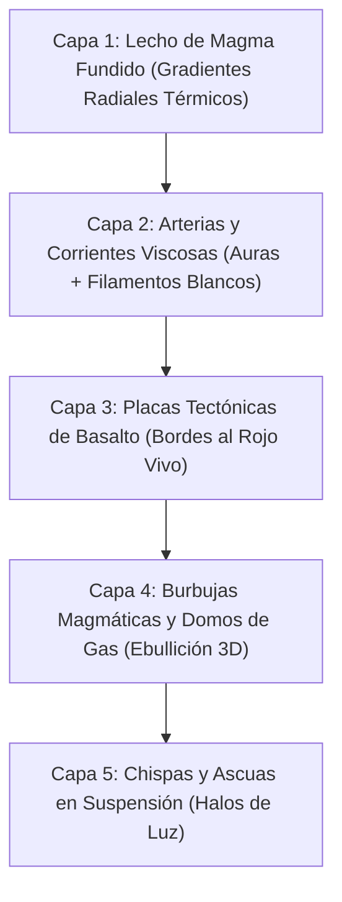

# 21. Sprite de Lava y Renderizado Ígneo Procedural

## 1. Resumen Ejecutivo y Motivación

En **Runa y Piedra**, los pozos y ríos de lava constituyen uno de los mayores peligros ambientales y desafíos plataformeros en mazmorras como *Cripta del Fuego* (`crypt_inferno`), *Mazmorra Ancestral* (`dungeon_classic`) y *Trono del Abismo* (`abyss_throne`). 

En versiones anteriores, el sprite de lava (Tile 13 en el Texture Atlas de Three.js) consistía en un fondo rojizo oscuro plano con 3 líneas curvas esquemáticas y 4 cuadriláteros aislados que simulaban flotar de manera estática. Esto producía un efecto visual desarticulado que no transmitía la viscosidad, el calor sofocante ni la incandescencia de un mar volcánico de magma fundido.

Con la versión **v1.27.0**, se rediseña por completo el sprite procedural de la lava (`BLOCK_TYPES.LAVA = 7`, Tile 13), transformándolo en una **superficie volcánica viva multicapa**:
- **Núcleo térmico incandescente**: Gradientes radiales multi-etapa desde blanco-oro solar (`#fffbeb` y `#fef08a`) hasta carmesí volcánico profundo (`#450a0a`).
- **Canales de flujo y afluentes viscosos**: Corrientes magmáticas con 4 niveles concéntricos de temperatura (aura térmica, corriente líquida naranja, núcleo áureo y filamento blanco incandescente).
- **Corteza de basalto y obsidiana con bordes fundidos**: 6 placas tectónicas de enfriamiento con bisel 3D, micro-grietas de contracción térmica y costra de roca volcánica (`#1c1917` y `#2d2a29`).
- **Burbujas magmáticas y domos de gas**: Domos de ebullición con reflejo especular elíptico y cráteres abiertos por erupción de gases.
- **Chispas y ascuas flotantes**: Partículas ígneas en suspensión con halos translúcidos de radiación atmosférica.

---

## 2. Especificación Técnica de Tile 13

| Propiedad | Valor / Definición | Archivo de Origen |
| :--- | :--- | :--- |
| **Identificador Numérico** | `BLOCK_TYPES.LAVA = 7` | [`src/config/constants.js`](file:///data/data/com.termux/files/home/develop/game/src/config/constants.js) |
| **Multiplicador de Color Three.js** | `0xffffff` (blanco neutro para fidelidad 100% del SVG) | [`src/config/constants.js`](file:///data/data/com.termux/files/home/develop/game/src/config/constants.js) |
| **Casilla en Texture Atlas** | **Tile 13** (Fila 3, Columna 1 en matriz 4x4) | [`src/render/TextureGenerator.js`](file:///data/data/com.termux/files/home/develop/game/src/render/TextureGenerator.js) |
| **Mapeo de Coordenadas UV** | `u: 0.25, v: 0.00` | [`src/render/VoxelMap.js`](file:///data/data/com.termux/files/home/develop/game/src/render/VoxelMap.js) |
| **Propiedades Físicas** | No sólido (`isSolid === false`), sumergible y mortal | [`src/core/PhysicsAABB.js`](file:///data/data/com.termux/files/home/develop/game/src/core/PhysicsAABB.js) |
| **Mecánica de Hundimiento** | Caída lenta amortiguada (`-1.0 m/s`), 36 ticks (~1.2s) | [`src/simulation/SimulationEngine.js`](file:///data/data/com.termux/files/home/develop/game/src/simulation/SimulationEngine.js) |

---

## 3. Desglose de Capas Vectoriales SVG

El sprite de 128x128 píxeles por bloque en el Texture Atlas se genera mediante 5 capas vectoriales superpuestas:

### 3.1 Gradientes Declarativos (`<defs>`)
1. **`lava-core-13`**: Gradiente radial térmico con 7 paradas de color:
   - `0%`: `#fffbeb` (temperatura máxima / centro incandescente)
   - `14%`: `#fef08a` (núcleo amarillo brillante)
   - `30%`: `#f59e0b` (ámbar solar)
   - `55%`: `#ea580c` (naranja ígneo)
   - `78%`: `#dc2626` (rojo magma fundido)
   - `92%`: `#991b1b` (carmesí viscoso)
   - `100%`: `#450a0a` (borde de enfriamiento)
2. **`lava-flow-13`**: Gradiente radial excéntrico para el meandro secundario del río de fuego (`#fef08a` a `#7f1d1d`).
3. **`lava-basalt-13`**: Gradiente lineal diagonal para dar volumen y profundidad 3D a las losas de piedra volcánica (`#2d2a29` a `#0c0a09`).
4. **`lava-bubble-13`**: Gradiente esférico para la convexidad tridimensional de los domos de gas en ebullición.

### 3.2 Canales y Arterias de Magma Viscoso
Las corrientes de lava combinan 4 pasadas de trazado continuo con terminaciones redondeadas (`stroke-linecap="round"`):
- **Aura térmica difusa** (`stroke-width="12-15"`, `opacity="0.55-0.65"`, color `#ea580c`).
- **Masa líquida naranja** (`stroke-width="6.5-8"`, color `#f97316`).
- **Núcleo solar brillante** (`stroke-width="2.8-3.5"`, color `#facc15`).
- **Filamento blanco incandescente** (`stroke-width="1.1-1.4"`, color `#fffbeb`).

### 3.3 Placas Tectónicas de Basalto con Bordes Fundidos
En lugar de fragmentos geométricos abstractos, el lecho presenta 6 placas tectónicas naturales más 1 islote central flotante:
- **Resplandor de contacto**: Doble trazo perimetral (`stroke="#b91c1c"` de 4px y `#f97316` de 1.5px) que simula el borde de la roca fundiéndose por el calor extremo de la corriente adyacente.
- **Micro-grietas de enfriamiento**: Finas fracturas internas en rojo vivo (`#7f1d1d` y `#ef4444`) que denotan la fragilidad de la costra en enfriamiento.
- **Textura de escoria**: Puntos de relieve en tono ceniza (`#3f3f46` y `#1c1917`).

### 3.4 Vents, Burbujas y Cráteres
- **Burbuja mayor** en `(48, 88)` con domo radial y brillo elíptico blanco (`#ffffff`, opacidad 0.9).
- **Burbujas medianas y menores** en `(106, 58)` y `(82, 78)` en diversas fases de expansión.
- **Cráter de erupción** en `(28, 38)` que muestra la corona de roca rota tras el escape de gases volcánicos con un centro amarillo incandescente.

### 3.5 Ascuas y Chispas Volcánicas
Seis ascuas dispersas con halo translúcido de disipación de calor (`#ea580c` y `#f97316` a 0.35 de opacidad) y centro blanco/amarillo de alto contraste (`#fffbeb`, `#ffffff` y `#fef08a`).

---

## 4. Cobertura de Pruebas y Verificación

La correcta asignación y renderizado del Tile 13 para bloques de lava está cubierta por la suite de pruebas unitarias de Node.js:

1. **`tests/levels.test.js`**:
   - `test('VoxelMap asigna el Tile 13 al bloque LAVA')`: Verifica que `VoxelMap.selectTile(x, y, z, BLOCK_TYPES.LAVA)` resuelva exactamente al índice 13.
2. **`tests/simulation.test.js`**:
   - Comprobación de detección de contacto con lava, hundimiento físico viscoso y penalización de vida.
3. **`tests/world.test.js`**:
   - Verificación de conteo y presencia de bloques `BLOCK_TYPES.LAVA` en las fosas inferiores (`y = -1`).
