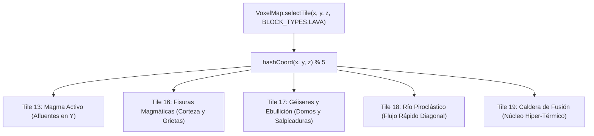

# 21. Sistema de Sprites de Lava y Renderizado Ígneo Procedural (Paleta de 5 Variantes)

## 1. Resumen Ejecutivo y Motivación

En **Runa y Piedra**, los pozos y ríos de lava constituyen uno de los mayores peligros ambientales y desafíos plataformeros en mazmorras como *Cripta del Fuego* (`crypt_inferno`), *Mazmorra Ancestral* (`dungeon_classic`), *Trono del Abismo* (`abyss_throne`) y el área de pruebas *Showroom de Desarrollo* (`dev_showroom`).

En versiones iniciales, el sprite de lava consistía en una única casilla plana repetitiva. Con la versión **v1.27.0** se introdujo el primer sprite multicapa de magma activo (Tile 13). Sin embargo, al igual que los muros (`WALL`) y las losas de suelo (`FLOOR`), que cuentan con 5 sprites distintos para evitar patrones repetitivos en cuadrícula (*grid fatigue*), la lava requería su propio conjunto de **5 variantes visuales** para lograr un mar volcánico verdaderamente heterogéneo, orgánico y dinámico.

Con la versión **v1.29.0**, el Texture Atlas vectorial se expande a una cuadrícula de **$4 \times 8$ casillas ($512 \times 1024$ px)** para incorporar una **paleta completa de 5 sprites ígneos especializados**:
1. **Tile 13 (Lava 1: Magma Activo con Afluentes en Y)**: Corrientes viscosas divergentes y placas de basalto en esquinas.
2. **Tile 16 (Lava 2: Fisuras Magmáticas y Corteza Tectónica)**: Corteza de roca volcánica fragmentada con red de grietas carmesí vivo y bordes de piedra fundiéndose.
3. **Tile 17 (Lava 3: Géiseres e Incandescencia Hirviente)**: Domos de gas volcánico a punto de estallar, salpicaduras térmicas y erupción de burbujas.
4. **Tile 18 (Lava 4: Río Piroclástico Rápido)**: Flujo direccional diagonal con orillas escarpadas de escoria y micro-corrientes superficiales.
5. **Tile 19 (Lava 5: Caldera de Fusión Pura / Hiper-Térmica)**: Núcleo solar blanco-dorado hiper-térmico con vórtice rotacional y calor extremo.



---

## 2. Especificación Técnica de la Cuadrícula 4x8 y Mapeo UV

Para mantener compatibilidad estricta con WebGL y optimización de texturas en GPU:
- **Dimensiones del Atlas**: $512 \times 1024$ píxeles (potencias de 2 exactas: $2^9 \times 2^{10}$).
- **Tamaño de Casilla**: $128 \times 128$ píxeles ($S = 128$).
- **Aspect Ratio 1:1 Preservado**: El fragment shader escala las coordenadas del mapa vóxel con `vec2(0.25, 0.125)` ($512 \times 0.25 = 128$ px, $1024 \times 0.125 = 128$ px), garantizando que las caras de los cubos no sufran deformaciones ni estiramientos.
- **Fórmula de Offset UV**:
  $$\begin{aligned}
  u &= (\text{tileIndex} \pmod 4) \times 0.25 \\
  v &= \left(7 - \lfloor \text{tileIndex} / 4 \rfloor\right) \times 0.125
  \end{aligned}$$

### Tabla de Coordenadas de los 5 Sprites de Lava

| Casilla | Nombre Técnico | Fila / Columna en Atlas 4x8 | $u$ (Offset X) | $v$ (Offset Y) | Característica Principal |
| :---: | :--- | :---: | :---: | :---: | :--- |
| **Tile 13** | `Lava 1 (Magma Activo)` | Fila 3, Col 1 | `0.250` | `0.500` | Afluentes ramificados en Y, 6 placas de basalto periféricas |
| **Tile 16** | `Lava 2 (Fisuras Magmáticas)` | Fila 4, Col 0 | `0.000` | `0.375` | Costra volcánica dominante con red de fracturas carmesí |
| **Tile 17** | `Lava 3 (Géiseres y Ebullición)` | Fila 4, Col 1 | `0.250` | `0.375` | 3 domos de gas en ebullición y salpicaduras de magma |
| **Tile 18** | `Lava 4 (Río Piroclástico)` | Fila 4, Col 2 | `0.500` | `0.375` | Corriente diagonal rápida y orillas de escoria aserradas |
| **Tile 19** | `Lava 5 (Caldera Hiper-Térmica)` | Fila 4, Col 3 | `0.750` | `0.375` | Vórtice térmico concéntrico y núcleo blanco-oro hirviente |

---

## 3. Desglose Artístico y Vectorial de las 5 Variantes

Para evitar colisiones de identificadores en el SVG monolítico del atlas, cada variante encapsula sus propios gradientes `<defs>` con sufijos numéricos unívocos (`-13`, `-16`, `-17`, `-18`, `-19`).

### 3.1 Tile 13: Magma Activo y Afluentes en Y
- **Flujo Magmático**: Trazado curvo bifurcado en Y con aura de disipación naranja (`#ea580c`, 14 px), masa líquida (`#f97316`, 7.5 px), corriente solar (`#facc15`, 3.2 px) y filamento incandescente blanco (`#fffbeb`, 1.2 px).
- **Roca Volcánica**: 6 placas de basalto periféricas (`#2d2a29` a `#0c0a09`) con bordes al rojo vivo (`#b91c1c` y `#f97316`) y micro-grietas térmicas.
- **Detalles**: Domo de gas en `(48, 88)`, cráter abierto en `(28, 38)` y ascuas flotantes con halo de radiación.

### 3.2 Tile 16: Fisuras Magmáticas y Corteza Tectónica
- **Enfoque Visual**: Representa un área donde la lava se ha enfriado parcialmente en superficie formando grandes losas de roca basáltica oscura, pero el magma del lecho empuja a presión abriendo profundas grietas.
- **Red de Fracturas**: 5 arterias quebradas de alta presión térmica (`#ea580c` $\to$ `#f97316` $\to$ `#fef08a`) que cruzan de extremo a extremo el bloque.
- **Bordes Fundidos**: Doble contorno ígneo con resplandor en `#ef4444` y `#ffedd5`.
- **Micro-ascuas**: 5 partículas puntuales de alta temperatura emergiendo de las hendiduras más estrechas.

### 3.3 Tile 17: Géiseres e Incandescencia Hirviente
- **Enfoque Visual**: Foco de máxima actividad gaseosa y descompresión volcánica.
- **Domos de Ebullición**: Gran burbuja esférica en `(64, 60)` de radio 16 px con gradiente esférico 3D (`#lava-gas-bubble-17`) y reflejo especular en medialuna blanca. Dos burbujas secundarias en `(32, 90)` y `(96, 32)`.
- **Erupción y Salpicaduras**: 7 gotas de magma proyectadas al aire en arcos balísticos con estela térmica.
- **Borde de Escoria**: Zócalos de piedra pómez porosa en las esquinas que enmarcan la piscina hirviente.

### 3.4 Tile 18: Río Piroclástico Rápido
- **Enfoque Visual**: Corriente magmática fluida y rápida en trayectoria diagonal (desde la esquina inferior izquierda hasta la superior derecha).
- **Lecho Fluídico**: Gradiente lineal diagonal `#lava-river-18` que transiciona suavemente a lo largo del vector de empuje.
- **Líneas de Corriente Superficial**: 3 estrías parabólicas afiladas (`stroke-dasharray="8 4 14 6"`) que transmiten velocidad y movimiento hidrodinámico en el fluido viscoso.
- **Orillas Escarpadas**: Riscos de escoria negra irregular (`#1c1917`) flanqueando el cañón de fuego.

### 3.5 Tile 19: Caldera de Fusión Pura (Hiper-Térmica)
- **Enfoque Visual**: El punto más caliente de la fosa, una caldera de fusión total donde la roca se licúa completamente.
- **Núcleo Térmico**: Gradiente radial concéntrico `#lava-hyper-19` con más del 50% de su área dominada por temperaturas blanco-oro y amarillo solar (`#ffffff`, `#fffbeb`, `#fef08a`).
- **Vórtice Térmico**: Ondas de choque circulares concéntricas y espirales térmicas que simulan un remolino de convección volcánica.
- **Mínima Escoria**: Solo diminutos fragmentos periféricos de roca fundiéndose antes de ser consumidos por la caldera.

---

## 4. Distribución Espacial Determinista en `VoxelMap.js`

La selección del sprite se efectúa de forma determinista para cada bloque de lava en la escena, garantizando que el mapa sea visualmente rico pero idéntico entre clientes en sesiones multijugador P2P:

```javascript
case BLOCK_TYPES.LAVA: {
  // Paleta de 5 variantes ígneas (Tiles 13, 16, 17, 18, 19)
  const lavaPalette = [13, 16, 17, 18, 19];
  return lavaPalette[h % lavaPalette.length];
}
```

Donde `h = VoxelMap.hashCoord(x, y, z)` es la función hash espacial pseudoaleatoria $O(1)$ basada en enteros. Esto produce una dispersión homogénea (~20% por cada variante) distribuida sin patrones repetitivos a lo largo de fosas y abismos.

---

## 5. Cobertura de Pruebas y Verificación

La arquitectura de 5 sprites y la cuadrícula $4 \times 8$ están verificadas exhaustivamente por la suite de pruebas unitarias (`npm test`):

1. **`tests/levels.test.js`**:
   - `test('VoxelMap distribuye deterministamente las 5 variantes de sprites para el bloque LAVA')`: Evalúa las coordenadas de una fosa de lava típica y confirma que las 5 variantes (13, 16, 17, 18, 19) son seleccionadas en el mundo.
   - `test('VoxelMap.getTileUVOffset calcula coordenadas UV exactas para la cuadrícula 4x8')`: Valida algebraicamente que los offsets $(u, v)$ de los tiles 0, 13, 16 y 19 coincidan exactamente con la especificación de 8 filas.
2. **`tests/simulation.test.js`**:
   - Valida que la interacción física (inmersión viscosa, bloqueo de salto, daño periódico y reaparición en respawn pad) se mantenga inalterada con independencia del sprite visual asignado.
