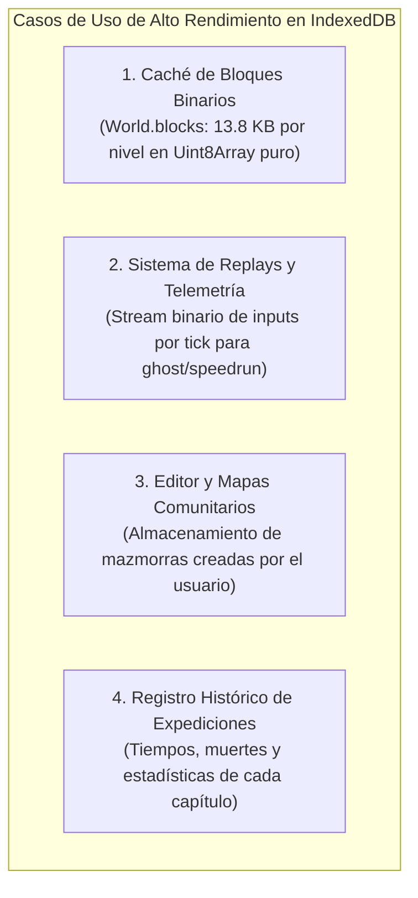
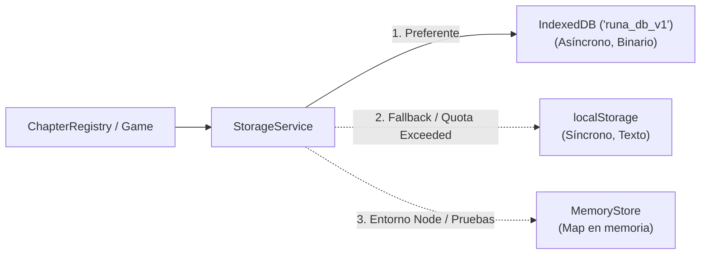
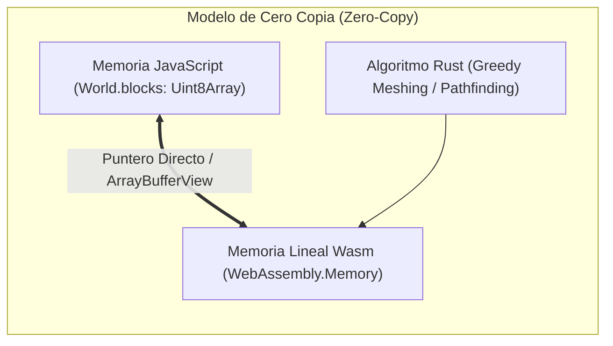

# 24. Persistencia Avanzada con IndexedDB y Cómputo Intensivo con Rust / WebAssembly

Este documento evalúa técnica y operativamente la integración de dos tecnologías clave para la evolución a largo plazo de **Runa y Piedra**:
1. **IndexedDB** como motor de almacenamiento asíncrono y masivo.
2. **Rust compilado a WebAssembly (Wasm)** para algoritmos de alta densidad de cómputo.

Ambas soluciones preservan los dos pilares inviolables del proyecto:
- **Tasa estable de 60 FPS** en smartphones estándar (3–4 GB RAM, WebGL 2.0).
- **Presupuesto de bundle < 500 KB** por fragmento de código (Code-Splitting Vite).

---

## 1. Persistencia Avanzada: `IndexedDB` vs `localStorage`

### 1.1. Matriz Comparativa de Capacidades

| Criterio | `localStorage` (Estado Actual) | `IndexedDB` (Propuesta Escalada) |
| :--- | :--- | :--- |
| **Naturaleza de Operación** | Sincrónica (bloquea el hilo de render) | Asincrónica (basada en promesas y transacciones) |
| **Límite de Capacidad** | $\approx 5\text{ MB}$ por origen | $\ge 50\text{ MB}$ hasta Gigabytes según cuota de disco |
| **Tipos de Datos** | Únicamente cadenas de texto (requiere `JSON.stringify`) | Binarios nativos (`ArrayBuffer`, `Uint8Array`, `Blob`), objetos estructurados |
| **Impacto en Frames (Framerate)** | Micro-tirones (*jank*) si el payload supera $\approx 50\text{ KB}$ | **Cero impacto en el bucle de render** |
| **Soporte en Web Workers** | No disponible | **Disponible** (permite guardar mapas en segundo plano) |

### 1.2. Casos de Uso Clave en *Runa y Piedra*



### 1.3. Arquitectura del Adaptador de Almacenamiento

Para mantener máxima resiliencia en entornos privados o sin soporte completo de base de datos, se establece un patrón de adaptador híbrido:



---

## 2. Aceleración con Rust y WebAssembly (Wasm)

### 2.1. Viabilidad Técnica en el Ecosistema del Proyecto

WebAssembly ejecuta código de bajo nivel a velocidad cercana al metal dentro de la máquina virtual del navegador (V8/SpiderMonkey). La integración se realiza mediante `wasm-bindgen` y el plugin `vite-plugin-wasm` o carga dinámica nativa de módulos `.wasm`.

### 2.2. Evaluación de Impacto: ¿Dónde sí y dónde no?

| Área de Cálculo | JavaScript Puro (V8) | Rust + Wasm | Ganancia Estimada | Veredicto |
| :--- | :---: | :---: | :---: | :---: |
| **Física de Jugadores (5 aventureros)** | $< 0.3\text{ ms}$ / tick | $< 0.1\text{ ms}$ / tick | Despreciable | ❌ **No recomendado** (añade fricción FFI innecesaria) |
| **UI, Eventos y Menús DOM** | Inmediato | Lento (puente DOM) | Negativo | ❌ **No recomendado** (debe ser 100% JS) |
| **Greedy Meshing de Vóxeles** | $15\text{–}30\text{ ms}$ en mapas $64^3$ | $1.5\text{–}3\text{ ms}$ | **$8\text{x a } 10\text{x}$** | ✅ **Altamente recomendado en Fase 4** |
| **Pathfinding A\* 3D (IA / Enemigos)** | Garbage Collector frecuente | Cero pausas de GC | **$5\text{x a } 7\text{x}$** | ✅ **Recomendado si se añaden monstruos** |
| **Generación Procedural Determinista** | Bucle 3D intensivo en CPU | Simplex Noise y autómatas en $\mu\text{s}$ | **$6\text{x}$** | ✅ **Recomendado para Capítulos 4 a 10** |



### 2.3. Presupuesto de Rendimiento y Tamaño del Binario

- Un módulo Rust compilado con `cargo build --target wasm32-unknown-unknown --release`, optimizado con:
  ```toml
  [profile.release]
  opt-level = "z"     # Optimizar para tamaño mínimo
  lto = true          # Link-Time Optimization
  codegen-units = 1
  panic = "abort"
  ```
  y procesado con `wasm-opt -Oz`, produce un archivo `.wasm` de entre **$15\text{ KB}$ y $40\text{ KB}$ (comprimido en gzip)**.
- Esto encaja sin dificultad dentro de la cuota de Vite (`< 500 KB`).

### 2.4. Compatibilidad con el Entorno Termux y CI

- **Termux (Android)**: Soporta Rust directamente (`pkg install rust`). La compilación de `.wasm` es nativa mediante `rustup target add wasm32-unknown-unknown`.
- **Integración Continua (GitHub Actions)**: Se incorpora el paso `actions-rs/toolchain` en `.github/workflows/ci.yml` para compilar los artefactos `.wasm` antes de la etapa de empaquetado de Vite.

---

## 3. Plan de Adopción Gradual

1. **Fase Actual (Paso 2 de Capítulos)**:
   - Mantener el esquema ligero en `localStorage` y preparar el adaptador asíncrono `StorageService` compatible con `IndexedDB`.
2. **Fase de Escalado (Capítulos 4 a 10)**:
   - Habilitar `IndexedDB` para guardar las matrices de los 30 niveles y capturas de replays de alta fidelidad.
   - Prototipar el módulo Rust Wasm para el generador procedural determinista de salas.
